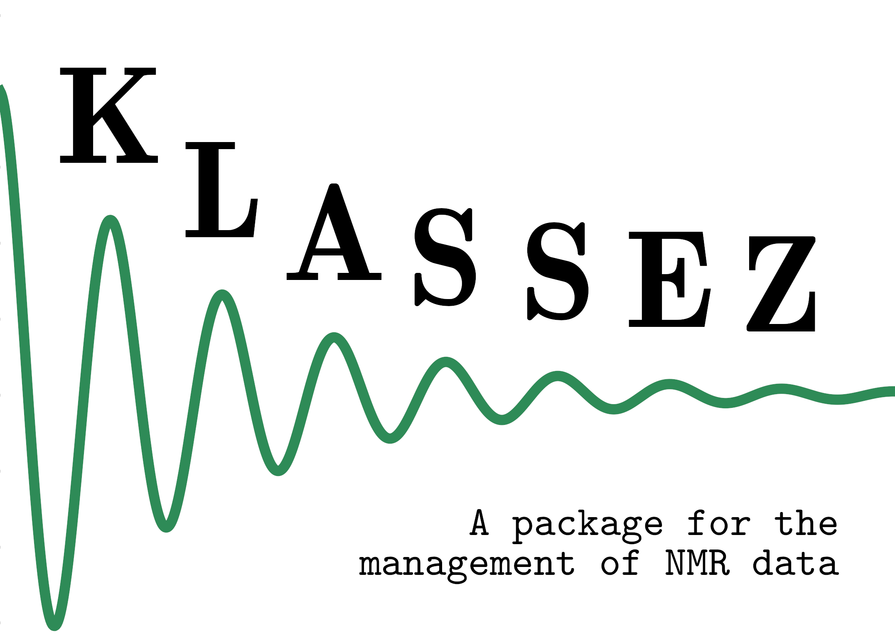

.. container:: center
   
   **Author**: Francesco Bruno

   **Major contributors**: Letizia Fiorucci

   **Version**: 0.5a.1

   **Documentation release date**: |today|

The **KLASSEZ** package is a collection of classes and functions to handle NMR data.
It is organized in modules, each of which contains functions dedicated to specific tasks.
Some of the functions employed by **KLASSEZ** are taken from the `nmrglue package`_ and modified to suit the needs of the **KLASSEZ** package itself.
**KLASSEZ** is developed and tested on Ubuntu 24.04 LTS. Other OS should encounter no issues; however, if it raises any errors, please notify.

Full documentation is available at `https://klassez.readthedocs.io/latest/`_.

.. _nmrglue package: https://nmrglue.readthedocs.io/en/latest/#
.. _https://klassez.readthedocs.io/latest/: https://klassez.readthedocs.io/latest/

Contents
=====================

.. toctree::
   :maxdepth: 2
   
   intro_klassez
   installation
   userguide
   mof_list
   
   
   

Indices and tables
==================

* :ref:`genindex`
* :ref:`modindex`
* :ref:`search`

        

