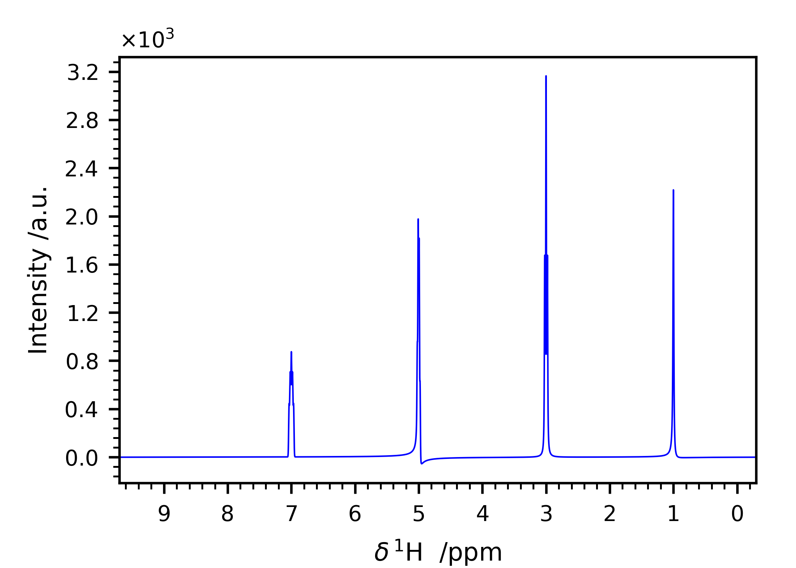
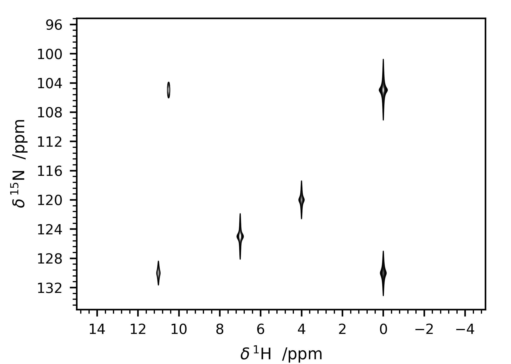

.. _userguide:

User Guide and Examples
=======================

Processing of a "raw" 1D spectrum
*********************************

Let us say that your spectrum is saved in the folder
*/home/myself/spectra/mydataset/1/*. Initialize the spectrum object
through:

::

   Path = r"/home/myself/spectra/mydataset/1/"
   s = Spectrum_1D(Path)

This command will do three main tasks:

-  read the binary FID of your spectrum and store it in a complex array
   ``s.fid``;

-  load the acquisition parameters, read the interesting keys and store
   them in a dictionary ``s.acqus``;

-  initialize a dictionary ``s.procs`` which contains the processing
   parameters.

**KLASSEZ** is able to read also Varian and Spinsolve (Magritek) data,
by specifying the option "``spect``".

A detailed description of ``acqus`` and ``procs`` is shown in
table `1 <#t:acqus_1D>`__ and table `2 <#t:procs_1D>`__.

Please note that reading the spectrum causes the program to save a file
called *"name.procs"*, where "name" is the path name.

.. container::
   :name: t:acqus_1D

   .. table:: Description of the ``acqus`` dictionary of a ``Spectrum_1D`` object.

      +-------------+-------------------------------------------------------+
      | Key         | Explanation                                           |
      +=============+=======================================================+
      | ``B0``      | Magnetic field strength /T                            |
      +-------------+-------------------------------------------------------+
      | ``spect``   | Spectrometer format: ``simulated``, ``bruker``,       |
      |             | ``varian``, ``oxford``                                |
      +-------------+-------------------------------------------------------+
      | ``BYTORDA`` | Endianness of binary data: ``0`` little endian, ``1`` |
      |             | big endian                                            |
      +-------------+-------------------------------------------------------+
      | ``DTYPA``   | Binary data type: ``0`` *int32*, ``2`` *float64*      |
      +-------------+-------------------------------------------------------+
      | ``GRPDLY``  | Number of points of the digital filter                |
      +-------------+-------------------------------------------------------+
      | ``nuc``     | Observed nucleus                                      |
      +-------------+-------------------------------------------------------+
      | ``o1p``     | Carrier frequency i.e. center of the spectrum, in ppm |
      +-------------+-------------------------------------------------------+
      | ``o1``      | Same as ``o1p``, but in Hz                            |
      +-------------+-------------------------------------------------------+
      | ``SWp``     | Sweep width, in ppm                                   |
      +-------------+-------------------------------------------------------+
      | ``SW``      | Sweep width, in Hz                                    |
      +-------------+-------------------------------------------------------+
      | ``SFO1``    | Larmor frequency of the observed nucleus at field     |
      |             | ``B0``                                                |
      +-------------+-------------------------------------------------------+
      | ``TD``      | Number of sampled complex points                      |
      +-------------+-------------------------------------------------------+
      | ``dw``      | Dwell time, i.e. the sampling interval, in seconds    |
      +-------------+-------------------------------------------------------+
      | ``AQ``      | Time duration of the FID                              |
      +-------------+-------------------------------------------------------+
      | ``t1``      | Acquisition timescale                                 |
      +-------------+-------------------------------------------------------+

.. container::
   :name: t:procs_1D

   .. table:: Description of the ``procs`` dictionary of a ``Spectrum_1D`` object.

      +------------+--------------------------------------------------------+
      | Key        | Explanation                                            |
      +============+========================================================+
      | ``wf``     | Window function. This is a dictionary itself:          |
      |            |                                                        |
      |            | -  ``"mode"``: choose function between                 |
      |            |                                                        |
      |            |    -  ``"no"``: no apodization                         |
      |            |                                                        |
      |            |    -  ``"em"``: exponential                            |
      |            |                                                        |
      |            |    -  ``"sin"``: sine                                  |
      |            |                                                        |
      |            |    -  ``"qsin"``: squared sine                         |
      |            |                                                        |
      |            |    -  ``"gm"``: mixed lorentzian-gaussian              |
      |            |                                                        |
      |            |    -  ``"gmb"``: mixed lorentzian-gaussian, Bruker     |
      |            |       style                                            |
      |            |                                                        |
      |            | -  ``"lb"``: Exponential line-broadening. Read by      |
      |            |    ``em``                                              |
      |            |                                                        |
      |            | -  ``"lb_gm"``: Exponential line-broadening. Read by   |
      |            |    ``gm``                                              |
      |            |                                                        |
      |            | -  ``"gb"``: Gaussian line-broadening. Read by ``gmb`` |
      |            |                                                        |
      |            | -  ``"gb_gm"``: Gaussian line-broadening. Read by      |
      |            |    ``gm``                                              |
      |            |                                                        |
      |            | -  ``"gc"``: Center of the gaussian :math:`\in [0,1]`. |
      |            |    Read by ``gm``                                      |
      |            |                                                        |
      |            | -  ``"ssb"``: Shift of the sine bell. Read by ``sin``  |
      |            |    and ``qsin``                                        |
      |            |                                                        |
      |            | -  ``"sw"``: Sweep width. Automatically set according  |
      |            |    to ``acqus["SW"]``                                  |
      +------------+--------------------------------------------------------+
      | ``zf``     | Zero-filling. Set the *final* number of points!        |
      +------------+--------------------------------------------------------+
      | ``tdeff``  | Number of points to be used for processing             |
      +------------+--------------------------------------------------------+
      | ``fcor``   | Scaling factor for the first point of the FID before   |
      |            | Fourier transform                                      |
      +------------+--------------------------------------------------------+
      | ``p0``     | Frequency-independent phase correction /degrees        |
      +------------+--------------------------------------------------------+
      | ``p1``     | First order phase correction /degrees                  |
      +------------+--------------------------------------------------------+
      | ``pv``     | Pivot point for the first order phase correction /ppm  |
      +------------+--------------------------------------------------------+
      | ``basl_c`` | Set of coefficients of a polynomion to be used as      |
      |            | baseline, starting from the :math:`0`-order            |
      |            | coefficient                                            |
      +------------+--------------------------------------------------------+
      | ``cal``    | Offset, in ppm, to be added to the frequency and ppm   |
      |            | scales for calibration                                 |
      +------------+--------------------------------------------------------+

To make the Fourier transform of the FID to obtain the spectrum, you
must invoke the :meth:`process` method, which reads the ``procs`` dictionary
to get the instructions on the processing you want to make on your
spectrum. For instance, if you want to obtain a final spectrum of
:math:`8k` points with an exponential broadening of 25 Hz:

::

   s.procs["wf"]["mode"] = "em"
   s.procs["wf"]["lb"] = 25
   s.procs["zf"] = 8192
   s.process()
   s.pknl()    # Tries to remove the digital filter through a first-order phase correction

It is also possible to use composite functions by combining more methods.
For instance:

::

   s.procs["wf"]["mode"] = "em", "qsin"
   s.procs["wf"]["lb"] = 10, 0
   s.procs["wf"]["ssb"] = 0, 2

will generate a composite window function made with ``em, lb=10`` and ``qsin, ssb=2``.

Calling the :meth:`process` method generates new attributes of the class:

-  ``freq``: the frequency scale, in Hz;

-  ``ppm``: the ppm scale;

-  ``r``: the real part of the spectrum;

-  ``i``: the imaginary part of the spectrum;

-  ``S``: the complex spectrum
   (:math:`{\tt S} = {\tt r} + \ui {\tt i}`).

After the Fourier transform, the :meth:`process` method applies the phase
correction and the calibration using the phase angles and the
calibration value saved in the ``procs`` dictionary automatically. This
allows the user to not phase their spectra every time, as well as
keeping a record of the processing.

If the spectrum requires phase correction, you can perform it
interactively:

::

   s.adjph()

or by passing the phase angles, in degrees, to :meth:`adjph`. Example, if
you know you need to phase your spectrum with :math:`30` degrees of
:math:`\phi^{(0)}` and :math:`-55` degrees of :math:`\phi^{(1)}` with
the pivot set at 7.32 ppm:

::

   s.adjph(p0=30, p1=-55, pv=7.32)

In both cases, the phase angles are updated in the ``procs`` dictionary.

The spectrum can be calibrated using a dedicated GUI:

::

   s.cal()

or specifying the shift value in ppm or in Hz (in this case, be sure to
set the ``isHz`` keyword to ``True``).

::

   s.cal(-3)               # Shift of -3 ppm
   s.cal(1000, isHz=True)  # Shift of +1 kHz   

Both ``ppm`` and ``freq`` are updated according to the given values.

The spectrum can be interactively integrated with a dedicated GUI, that calls for :func:`klassez.anal.integrate`, by typing:

::

   s.integrate()

The values of the integrals are saved in the ``integrals`` attribute.

The class ``pSpectrum_1D``
--------------------------

The class :class:`Spectrum_1D` does not work if you want to read the
processed data directly from TopSpin (or whatever software you used to
acquire and process them). Instead, you should use the class
:class:`klassez.Spectra.pSpectrum_1D`, which is designed to perform exactly this task. It
inherits most of the attributes and methods of the :class:`klassez.Spectra.Spectrum_1D`
class, therefore its usage closely resembles the example reported in the
previous section.

Processing of a "raw" 2D spectrum
*********************************

Let us say that your spectrum is saved in the folder
*/home/myself/spectra/mydataset/21/*. Initialize the spectrum object
through:

::

   Path = r"/home/myself/spectra/mydataset/21/"
   s = Spectrum_2D(Path)

The generated ``acqus`` and ``procs`` dictionaries include informations
on both dimensions.

.. container::
   :name: t:acqus_2D

   .. table:: Description of the ``acqus`` dictionary of a ``Spectrum_2D`` object.

      +-------------+-------------------------------------------------------+
      | Key         | Explanation                                           |
      +=============+=======================================================+
      | ``B0``      | Magnetic field strength /T                            |
      +-------------+-------------------------------------------------------+
      | ``BYTORDA`` | Endianness of binary data: ``0`` little endian, ``1`` |
      |             | big endian                                            |
      +-------------+-------------------------------------------------------+
      | ``DTYPA``   | Binary data type: ``0`` *int32*, ``2`` *float64*      |
      +-------------+-------------------------------------------------------+
      | ``GRPDLY``  | Number of points of the digital filter                |
      +-------------+-------------------------------------------------------+
      | ``nuc1``    | Observed nucleus in the indirect dimension            |
      +-------------+-------------------------------------------------------+
      | ``nuc2``    | Observed nucleus in the direct dimension              |
      +-------------+-------------------------------------------------------+
      | ``o1p``     | Carrier frequency i.e. center of the indirect         |
      |             | dimension, in ppm                                     |
      +-------------+-------------------------------------------------------+
      | ``o2p``     | Carrier frequency i.e. center of the direct           |
      |             | dimension, in ppm                                     |
      +-------------+-------------------------------------------------------+
      | ``o1``      | Same as ``o1p``, but in Hz                            |
      +-------------+-------------------------------------------------------+
      | ``o2``      | Same as ``o2p``, but in Hz                            |
      +-------------+-------------------------------------------------------+
      | ``SW1p``    | Sweep width of the indirect dimension, in ppm         |
      +-------------+-------------------------------------------------------+
      | ``SW2p``    | Sweep width of the direct dimension, in ppm           |
      +-------------+-------------------------------------------------------+
      | ``SW1``     | Sweep width of the indirect dimension, in Hz          |
      +-------------+-------------------------------------------------------+
      | ``SW2``     | Sweep width of the indirect dimension, in Hz          |
      +-------------+-------------------------------------------------------+
      | ``SFO1``    | Larmor frequency of the observed nucleus in F1 at     |
      |             | field ``B0``                                          |
      +-------------+-------------------------------------------------------+
      | ``SFO2``    | Larmor frequency of the observed nucleus in F2 at     |
      |             | field ``B0``                                          |
      +-------------+-------------------------------------------------------+
      | ``TD1``     | Number of :math:`t_1`-increments                      |
      +-------------+-------------------------------------------------------+
      | ``TD2``     | Number of sampled complex points                      |
      +-------------+-------------------------------------------------------+
      | ``dw1``     | :math:`t_1` increments, in seconds                    |
      +-------------+-------------------------------------------------------+
      | ``dw2``     | Dwell time, i.e. the sampling interval, in seconds    |
      +-------------+-------------------------------------------------------+
      | ``AQ1``     | Sampled timescale of the indirect dimension           |
      +-------------+-------------------------------------------------------+
      | ``AQ2``     | Time duration of the FID                              |
      +-------------+-------------------------------------------------------+
      | ``t1``      | Evolution timescale                                   |
      +-------------+-------------------------------------------------------+
      | ``t2``      | Acquisition timescale                                 |
      +-------------+-------------------------------------------------------+

.. container::
   :name: t:procs_2D

   .. table:: 
      Description of the ``procs`` dictionary of a
      ``Spectrum_2D`` object. Each of these dictionary entry is a list of
      two elements: the first one (index ``0``) is the processing to apply
      on the indirect dimension, the second (index ``1``) on the direct
      dimension. For instance, ``procs[tdeff] = [64, 1024]`` means to
      truncate the indirect evolutions to 64 points and the FIDs to 1024
      points.

      +-----------+---------------------------------------------------------+
      | Key       | Explanation                                             |
      +===========+=========================================================+
      | ``wf``    | Window function. This is a dictionary itself:           |
      |           |                                                         |
      |           | -  ``"mode"``: choose function between                  |
      |           |                                                         |
      |           |    -  ``"no"``: no apodization                          |
      |           |                                                         |
      |           |    -  ``"em"``: exponential                             |
      |           |                                                         |
      |           |    -  ``"sin"``: sine                                   |
      |           |                                                         |
      |           |    -  ``"qsin"``: squared sine                          |
      |           |                                                         |
      |           |    -  ``"gm"``: mixed lorentzian-gaussian               |
      |           |                                                         |
      |           |    -  ``"gmb"``: mixed lorentzian-gaussian, Bruker      |
      |           |       style                                             |
      |           |                                                         |
      |           | -  ``"lb"``: Exponential line-broadening. Read by       |
      |           |    ``em`` and ``gmb``                                   |
      |           |                                                         |
      |           | -  ``"lb_gm"``: Exponential line-broadening. Read by    |
      |           |    ``gm``                                               |
      |           |                                                         |
      |           | -  ``"gb"``: Gaussian line-broadening. Read by ``gmb``  |
      |           |                                                         |
      |           | -  ``"gb_gm"``: Gaussian line-broadening. Read by       |
      |           |    ``gm``                                               |
      |           |                                                         |
      |           | -  ``"gc"``: Center of the gaussian :math:`\in [0,1]`.  |
      |           |    Read by ``gm``                                       |
      |           |                                                         |
      |           | -  ``"ssb"``: Shift of the sine bell. Read by ``sin``   |
      |           |    and ``qsin``                                         |
      |           |                                                         |
      |           | -  ``"sw"``: Sweep width. Automatically set according   |
      |           |    to ``acqus["SW"]``                                   |
      +-----------+---------------------------------------------------------+
      | ``zf``    | Zero-filling. Set the *final* number of points!         |
      +-----------+---------------------------------------------------------+
      | ``tdeff`` | Number of points to be used for processing              |
      +-----------+---------------------------------------------------------+
      | ``fcor``  | Scaling factor for the first point of the FID before    |
      |           | Fourier transform                                       |
      +-----------+---------------------------------------------------------+
      | ``p02``   | Frequency-independent phase correction /degrees, direct |
      |           | dimension                                               |
      +-----------+---------------------------------------------------------+
      | ``p12``   | First order phase correction /degrees, direct dimension |
      +-----------+---------------------------------------------------------+
      | ``pv2``   | Pivot point for the first order phase correction /ppm,  |
      |           | direct dimension                                        |
      +-----------+---------------------------------------------------------+
      | ``p01``   | Frequency-independent phase correction /degrees,        |
      |           | indirect dimension                                      |
      +-----------+---------------------------------------------------------+
      | ``p11``   | First order phase correction /degrees, indirect         |
      |           | dimension                                               |
      +-----------+---------------------------------------------------------+
      | ``pv1``   | Pivot point for the first order phase correction /ppm,  |
      |           | indirect dimension                                      |
      +-----------+---------------------------------------------------------+
      | ``cal_1`` | Calibration offset for F1 /ppm                          |
      +-----------+---------------------------------------------------------+
      | ``cal_2`` | Calibration offset for F2 /ppm                          |
      +-----------+---------------------------------------------------------+

Then, the sequence of commands resembles the ones of the 1D spectra.

::

   s.process()     
   s.pknl()    # Remove the digital filter
   # Also in this case, phase correction and calibration are performed automatically with the values in procs
   s.adjph()
   s.plot()

The keys for ``adjph`` are of the kind: ``pXY``, where ``X`` is the
order of the phase correction (:math:`0` or :math:`1`) and ``Y`` is the
dimension on which to apply it (:math:`1` or :math:`2`). Explicative
table below:

.. container:: center

   ================== ======= =======
   \                  **F1**  **F2**
   ================== ======= =======
   :math:`\phi^{(0)}` ``p01`` ``p02``
   :math:`\phi^{(1)}` ``p11`` ``p12``
   pivot              ``pv1`` ``pv2``
   ================== ======= =======

On the processed data, one may want to use the method :meth:`qfil` to suppress the solvent signal.
This can be done interactively by invoking the function without further arguments:

::
        
   s.qfil()

The key ``qfil = {'u': u, 's': s}`` are then saved in the ``procs`` dictionary for additional use.

Another useful option is to make a so-called "strip transform" to use only the part of the spectrum you are interested in.
Example:

::

   xlim = (max(s.ppm), 6)
   ylim = None
   s.strip(xlim=xlim, ylim=ylim)

will trim the direct dimension from the left side of the spectrum to 6 ppm, and leave the indirect dimension untouched.

To read the processed data, use the :class:`pSpectrum_2D` class instead.

Computing projections
---------------------

While the 2D spectra give an overall look on the whole experiment, the
user might want to extract projection of the direct or the indirect
dimension, to focus onto particular features in the spectrum. In order
to do so, **KLASSEZ** offers two commands: ``projf1`` and ``projf2``,
which compute the sum projections on the indirect or on the direct
dimension, respectively, and store the result in dictionaries called
``trf1`` and ``trf2``, whose keys are the ppm values correspondant to
the projections. Actually, the capitalized versions of the two
dictionaries (with the same keys), i.e. ``Trf1`` and ``Trf2``, can be
more useful, as they are instances of the :class:`pSpectrum_1D` class and
therefore are initialized with ppm scales and other parameters.

Example:

::

   # Supposed to have a 1H-15N HSQC spectrum

   #   Extract the direct dimension trace at 115 ppm, 15N scale
   s.projf2(115)   
   #   Access to it through
   Proj_115 = s.Trf2['115.00']

   #   Extract the indirect dimension trace from 6 to 8 ppm, 1H scale
   s.projf1(6, 8)
   Proj_indim = s.Trf1['6.00:8.00']

   # You can plot them:
   Proj_115.plot()
   Proj_indim.plot()

Simulating data
***************

The classes :class:`Spectrum_1D` and :class:`Spectrum_2D` are also able to
generate simulated data by reading a custom-written input file. The
functions they use are :func:`klassez.sim.sim_1D` and :func:`klassez.sim.sim_2D`.

Simulate 1D data
----------------

The input file you have to write *must* have the following keys:

-  ``B0``: Magnetic field strength /T;

-  ``nuc``: Observed nucleus (e.g. ``13C``);

-  ``o1p``: Carrier frequency i.e. centre of the spectrum /ppm;

-  ``SWp``: Sweep width /ppm. The spectrum will cover the range
   :math:`[{\tt o1p} - {\tt SWp}/2, {\tt o1p} + {\tt SWp}/2]`;

-  ``TD``: Number of sampled (complex) points;

-  ``shifts``: sequence of peak positions /ppm;

-  ``fwhm``: Full-width at half-maximum of the peaks /Hz;

-  ``amplitudes``: Intensity of the peaks in the FID;

-  ``b``: Fraction of gaussianity. :math:`\beta = 0 \implies` pure
   Lorentzian peak, :math:`\beta = 1 \implies` pure Gaussian peak;

and *can* have the following keys:

-  ``phases``: phases of the peaks /degrees. Default: all zeros;

-  ``mult``: fine structures of the peaks (e.g. doublets of triplets:
   ``dt``). Default: all singlets;

-  ``Jconst``: coupling constants of the fine structures /Hz. If more of
   one coupling is expected, provide them as a sequence. Default: not
   used as the peaks are all singlets.

Key and value must be separated by a tab character. You are allowed to
leave empty rows to improve the readibility and to insert comments using
the ``#`` character.

Example:

::

   B0  16.4    # 700 MHz 1H
   nuc 1H
   o1p 4.7
   SWp 40
   TD  8192

   shifts  1, 3, 5, 7
   fwhm    [10 for k in range(4)]
   amplitudes  10, 20, 15, 10
   b       0, 0.4, 0.6, 1
   phases  5, 0, 10, 0

   mult    s, t, dt, ddd   
   Jconst  0, 15, [12, 9.5], [25, 15, 10]

This input file generates the spectrum in Figure `1 <#fig:test_1D>`__.

Code:

::

   #! /usr/bin/env python3

   from klassez import *

   s = Spectrum_1D('sim_in_1D', isexp=False)
   s.process()

   figures.figure1D(s.ppm, s.r, name='test_1D', X_label=r'$\delta\, ^1$H  /ppm', Y_label=r'Intensity /a.u.')

Simulate 2D data
----------------

The same procedure can be followed to simulate 2D spectra. The input
file to write is very similar to the one for 1D data, except for the
quantities that clearly span over two dimensions. As in NMR textbook,
the direct and indirect dimensions will be named F2 and F2 respectively,
and dimension-specific quantities will feature the 1 or 2 labels
accordingly.

-  ``B0``: Magnetic field strength /T;

-  ``nuc1``: Observed nucleus in F1(e.g. ``13C``);

-  ``nuc2``: Observed nucleus in F2(e.g. ``1H``);

-  ``o1p``: Carrier frequency i.e. center of F1 /ppm;

-  ``o2p``: Carrier frequency i.e. center of F2 /ppm;

-  ``SW1p``: Sweep width /ppm. The indirect dimension will cover the
   range :math:`[{\tt o1p} - {\tt SW1p}/2, {\tt o1p} + {\tt SW1p}/2]`;

-  ``SW2p``: Sweep width /ppm. The direct dimension will cover the range
   :math:`[{\tt o2p} - {\tt SW2p}/2, {\tt o2p} + {\tt SW2p}/2]`;

-  ``TD1``: Number of sampled (complex) points in F1;

-  ``TD2``: Number of sampled (complex) points in F2;

-  ``shifts_f1``: sequence of peak positions in F1 /ppm;

-  ``shifts_f2``: sequence of peak positions in F2 /ppm;

-  ``fwhm_f1``: Full-width at half-maximum of the peaks in F1 /Hz;

-  ``fwhm_f2``: Full-width at half-maximum of the peaks in F2 /Hz;

-  ``amplitudes``: Intensity of the peaks in the FID;

-  ``b``: Fraction of gaussianity. :math:`\beta = 0 \implies` pure
   Lorentzian peak, :math:`\beta = 1 \implies` pure Gaussian peak;

Phase distortions and fine structures are not allowed for
multidimensional spectra. The indirect dimension will be generated
employing the *States-TPPI* sampling scheme.

Example:

::

   B0  28.2
   nuc1    15N 
   nuc2    1H
   o1p 115 
   o2p 5   
   SW1p    40  
   SW2p    20
   TD1 512 
   TD2 8192

   shifts_f1   130.0, 105.0, 120.0, 1.25e2, 130.0, 105.0
   shifts_f2   0.0, 0.0, 4.0, 7.0, 1.1e1, 10.5
   fwhm_f1 100, 100, 100, 100, 100, 100
   fwhm_f2 50, 50, 50, 50, 50, 50
   amplitudes  10, 20, 10, 20, 10, 10
   beta    0.0, 0.2, 0.4, 0.6, 0.8, 1.0

This input file generates the spectrum in Figure `2 <#fig:test_2D>`__.

Code:

::

   #! /usr/bin/env python3

   from klassez import *

   s = Spectrum_2D('sim_in_2D', isexp=False)
   s.process()

   figures.figure2D(s.ppm_f2, s.ppm_f1, s.rr, lvl=0.005, name='test_2D', X_label=r'$\delta\, ^1$H  /ppm', Y_label=r'$\delta\, ^{15}$N  /ppm')

The ``Pseudo_2D`` class
***********************

Sometimes, the spectroscopist might find interesting to acquire a series
of 1D experiments in which one (or more) parameters are changed
according to a certain schedule. This kind of experiments are 2D in
principle, but their processing and analysis resemble the one of 1D
spectra. Therefore, they lie somewhere in between 1D spectra and 2D
spectra, hence they are often referred to as *pseudo_2D*.

Also in this case, **KLASSEZ** offers a specific class to deal with this
kind of data: :class:`klassez.Spectra.Pseudo_2D`. :class:`Pseudo_2D` is a subclass of
:class:`Spectrum_2D`; however, many functions have been adapted to resemble
the 1D version.

:class:`Pseudo_2D` does not encode for a routine to automatically simulate
data. If you want to, you should give a 1D-like input file (just like
the one in the previous section), and replace the attribute
``fid`` with your FID by using the method :meth:`mount`, generated as you
wish. With a real dataset this is not required, as it is able to read
everything automatically.

::

   path_to_pseudo = "/home/myself/spectra/mydataset/899/"
   s = Pseudo_2D(path_to_pseudo)

The :meth:`process()` function applies apodization, zero-filling and Fourier
transform only on the direct dimension, reading the parameters from a
``procs`` dictionary like the one of :class:`Spectrum_1D`. The attributes
``freq_f1`` and ``ppm_f1`` are initialized with
``np.arange(N)``, where ``N`` is the number of
experiments that your FID comprises of. In particular, ``freq_f1``
numbers the experiments sequentially from :math:`0` to :math:`N-1`,
whereas ``ppm_f1`` does it from :math:`1` to :math:`N`. Therefore, when
calling the method ``projf2`` to extract the experiments as
``Spectrum_1D`` objects, the argument must follow ``ppm_f1``. As an
example, to project the first transient, one should type

::

   s.projf2(1)

and access to it from

::

   t = s.Trf2["1.00"]

The user can replace this "standard" numbering with the actual parameter
that is varied during the evolution of the indirect dimension, by
substitution of the ``ppm_f1`` attribute. As a result, the projection
must be performed according to this new scale.

The phase adjustment is performed on a reference spectrum, then applied
on the whole 2D matrix. By default, the chosen spectrum is the first
one, but you can choose the one that fits the most your needs.

::

   s.process()
   s.pknl()        # Tries to remove the digital filter
   s.adjph(expno=10) # Calls interactive_phase_1D on the 10th experiment

The method :meth:`plot` shows the 2D contour map of the spectrum, just like
the one of :meth:`Spectrum_2D`. However, this is not always the most
intelligent way to plot the data in order to gather information. This is
the reason why this class features two unique additional methods that
plot data: :meth:`plot_md` and :meth:`plot_stacked`. Both rely on the parameter
``which``, that is a string of code (i.e. it should be interpreted by
``eval``) that identifies which experiment to show by pointing at their
index. ``which = "all"`` results in pointing at all spectra.

::

   s.plot()    # 2D contour map
   s.plot_md(which="3, 5, 11")     # Plot the 3rd, the 5th and the 11th spectrum, superimposed
   s.plot_stacked(which="np.arange(0,100,5)")  # Makes a stacked plot with a spectrum every 5

The method ``integrate`` differs a little bit from the one coded in
``Spectrum_1D``.

::

   s.integrate(which=2)        # Interactive panel on the 3rd spectrum

Even if you select the integration limits on a single spectrum, the
method ``integrate`` will compute the integrals throughout the whole
range of experiment. This means that each entry of ``integrals`` will be
an array as long as the number of experiment.

Deconvolution of 1D datasets
****************************

The class :class:`klassez.fit.Voigt_Fit` in *KLASSEZ* offers a very convenient
interface to deconvolve a spectrum by fitting. A shortcut to the class,
which initializes the parameters automatically, is implemented in the
attribute ``F`` of :class:`Spectrum_1D`.

To generate the input guess for the fit, you have to call the method
:meth:`iguess` of the class. This can work in two different modes: the
default one, which allows to build the guess peak-by-peak, and with
``auto=True``, that features a peak-picker for the selection. The former
is more precise, the second is much faster.

Whatever the employed method, the building of the initial guess is a
two-stage process. First, you must zoom in with the :mod:`matplotlib`
interactive viewer on the region of the spectrum you are interested in.
Then, you can build the guess following the instructions in the GUI.
When you press "SAVE", your guess is stored, and the spectrum returns to
the original view.

The "manual" mode allows to optimize a polynomial baseline for each
interval. A button labelled "SET BASL" must be pressed when a satisfying
region is highlighted in the GUI: this allows the scale on which the
baseline is computed to be correctly aligned to the region itself. When
this step is correctly performed, the box next to the button turns from
red to green. Should the region be moved during the optimization of the
initial guess, the box turns back to red, and the "SET BASL" button must
be pressed again to adjust the baseline scale accordingly.

The information on the peaks is saved in a `.vf` file, which can be
imported with the function :func:`klassez.fit.read_vf``. There are two kind of
`.vf` file: `.ivf`, that marks initial guesses, and `.fvf`, for
the results of the fit. However, this is a human-only distinction, as
the structure of the files is the same.

An example of `.vf` file is shown here:

::

   ! Initial guess computed by francesco on 11/11/2024 at 15:48:44

             Region;      Intensity
   ------------------------------------------------------------------------------------------------
    193.317:168.041;   8.08246575e+00

      #;              u;           fwhm;    Rel. I.;      Phase;       Beta;      Group
   ------------------------------------------------------------------------------------------------
      1;   179.94060191;     172.500000;   1.000000;    -10.000;    0.00000;          0
   ------------------------------------------------------------------------------------------------

   ================================================================================================

             Region;      Intensity
   ------------------------------------------------------------------------------------------------
       59.936:6.662;   5.02908980e+01

      #;              u;           fwhm;    Rel. I.;      Phase;       Beta;      Group
   ------------------------------------------------------------------------------------------------
      2;    40.29851786;     150.000000;   0.214286;      0.000;    0.00000;          0
      3;    24.98695246;     140.000000;   0.785714;     10.000;    0.00000;          0
   ------------------------------------------------------------------------------------------------

   ================================================================================================

The header line, that starts with a `!`, is a comment, and acts as a
separator between different attempts of the fit. In fact, `.vf` files
are never overwritten: working again on the same file appends the
information at the bottom. Hence, there is a parameter ``n`` in the
:func:`klassez.fit.read_vf` function that allows to select which attempt to read.

Then, a series of blocks follow. Each block marks a region of selection:
the keys "Region" and "Intensity" mark the limits of the fitting window,
and the total intensity of the peaks. Under this line, there is a table
that collects the peak parameters. As a final information there might be
the baseline coefficients for the given region, which start with the key
"BASL_C". Should this line be missing, it means that the baseline was
not optimized during the computation of the guess, and the coefficients
will all be set to 0 when the file is read. The end of the block is
marked with a line of "=".

The method :meth:`iguess` automatically search for the existing input file.
If it finds it, it is automatically loaded. Otherwise, the GUI for the
computation of the initial guess opens up.

The fit can be performed by calling the method :meth:`dofit`, which returns
a list of ``lmfit.MinimizerResult`` objects (one for each region) for a
detailed inspection on how the fit performed. The behavior of the fit
can be customized by setting the parameters of the method (see examples
or the dedicated page of the manual). The fit goes region-by-region, and
the results are saved in a `.fvf` file.

A `.fvf` file can be loaded using the method :meth:`load_fit`.

Either the initial guess or the result of the fit can be conveniently
visualized by using the method :meth:`plot`. Alternatively, the arrays of
the model can be retrieved by calling :meth:`calc_fit_lines`. The method
:meth:`res_histogram` computes the histogram of the residuals, for a better
understanding of the outcome of the fit procedure.

Vide infra for a working example.

Example scripts
***************

Reading and processing of 1D spectra
------------------------------------

::

   #! /usr/bin/env python3

   from klassez import *

   # Be aware that this is a BASIC processing
   # Read the documentation of the functions to see the full powers

   if 1:
       # This example is for the simulated data
       s = Spectrum_1D('acqus_1D', isexp=False)
       s.to_vf()   # You can convert info on peaks to .ivf for fitting
   else:
       # Use the following to read experimentals:
       spect = 'bruker', 'jeol', 'varian', 'magritek', 'oxford' # One of these
       s = Spectrum_1D(path_to_dataset, spect=spect)

   # Setup the processing
   #   Apodization
   #       Follow the table in the user manual to see what reads what
   s.procs['wf']['mode'] = 'em'
   s.procs['wf']['lb'] = 5
   #   Zero-filling
   s.procs['zf'] = 2**14

   #   Apply processing and do FT
   s.process()
   # Remove the digital filter
   s.pknl()
   # Phase correction
   s.adjph()
   # Plot the data
   s.plot()

Fit 1D spectrum
---------------

The beginning of the script is the same of the reading example.

::

   # s.F is a fit.Voigt_Fit object
   filename = 'test_1D_fit'    # base filename for everything fit-related
   # Compute the initial guess
   auto = False        # True for peak-picker, False for manual
   s.F.iguess(filename=filename, auto=auto)

   if 0:   # Do the fit
       lmfit_result = s.F.dofit(   ### Parameters of the fitting ###
               u_lim=5,            # movement for chemical shift /ppm
               f_lim=50,           # movement for linewidth /Hz
               k_lim=(0, 3),       # limits for intensity
               vary_phase=True,    # optimize the phase of the peak
               vary_b=True,        # optimize the lineshape (L/G ratio)
               method='leastsq',   # optimization method
               itermax=10000,      # max. number of iterations
               fit_tol=1e-10,      # arrest criterion threshold (see lmfit for details)
           basl_fit='fixed'    # how to handle the baseline during the fit
               filename=filename,  # filename for the .fvf file
               )
   else:
       # Load an existing .fvf file
       s.F.load_fit(filename=filename)

   # Plot the results
   s.F.plot(what='result',     # what='iguess' for initial guess
            show_total=True,   # Show the total trace or not
            show_res=True,     # Show the residuals
            res_offset=0.1,    # Displacement of the residuals (plots residuals - res_offset)
            labels=None,       # Labels for the peaks
            filename=filename, # Filename for the figures
            ext='png',         # format of the figure
            dpi=300,           # Resolution of the figure
            )

   # Compute histogram of the residuals
   s.F.res_histogram(what='result',
                 nbins=500,    # Number of bins of the histogram
                 density=True, # Normalize them
                 f_lims=None,  # Limits for x axis
                 xlabel='Residuals',   # Guess what!
                 x_symm=True,  # Symmetrize the x-scale
                 barcolor='tab:green',     # Color of the bars
                 fontsize=20,  # Guess what!
                 filename=filename, ext='png', dpi=300)

   # Convert the tables of numbers in arrays
   peaks, total, limits, whole_basl = s.F.get_fit_lines(what='result')

Read and process 2D spectrum
----------------------------

::

   #! /usr/bin/env python3

   from klassez import *

   # Be aware that this is a BASIC processing
   # Read the documentation of the functions to see the full powers

   if 1:
       # This example is for the simulated data
       s = Spectrum_2D('acqus_2D', isexp=False)
   else:
       # For experimentals, at version 0.4a.7 klassez reads only 2D bruker
       s = Spectrum_2D(path_to_dataset)

   # Setup the processing
   #   Apodization
   #       Follow the table in the user manual to see what reads what
   #       REMEMBER: index 0 is F1, index 1 is F2, for procs
   s.procs['wf'][1]['mode'] = 'em'
   s.procs['wf'][1]['lb'] = 5
   s.procs['wf'][0]['mode'] = 'qsin'
   s.procs['wf'][0]['ssb'] = 2
   #   Zero-filling
   s.procs['zf'] = 512, 2048

   #   Apply processing and do FT
   s.process()
   # Remove the digital filter
   s.pknl()
   # Phase correction
   s.adjph()
   # Plot the data
   s.plot()

   # Extract projections
   ppm_f2 = 180
   ppm_f1 = 10
   s.projf1(ppm_f2)    # Extract F1 trace @ ppm_f2 ppm
   f1 = s.Trf1[f'{ppm_f2:.2f}']    # Call it back: it is a Spectrum_1D object!
   f1.plot()
   s.projf2(ppm_f1)    # Extract F2 trace @ ppm_f1 ppm
   f2 = s.Trf2[f'{ppm_f1:.2f}']    # Call it back: it is a Spectrum_1D object!
   f2.plot()

