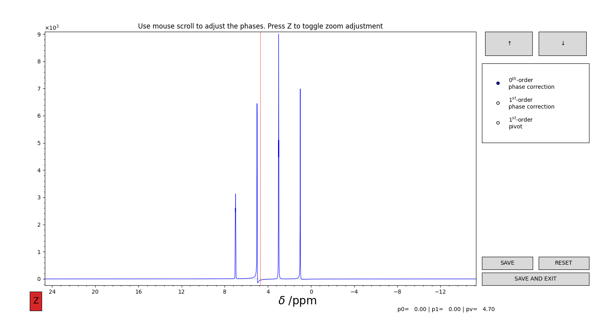
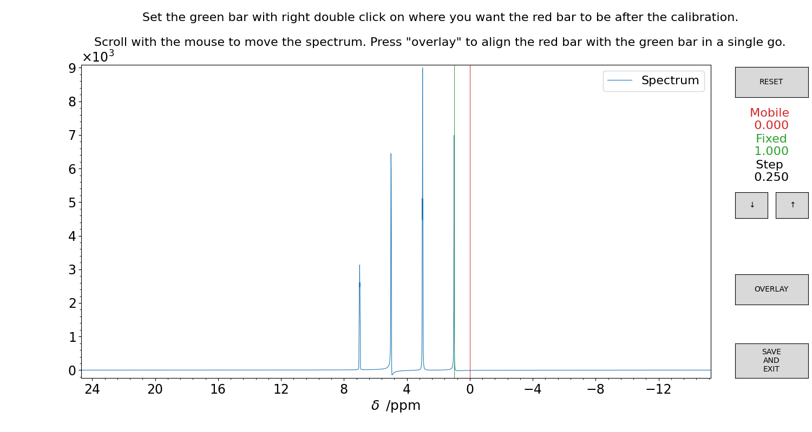
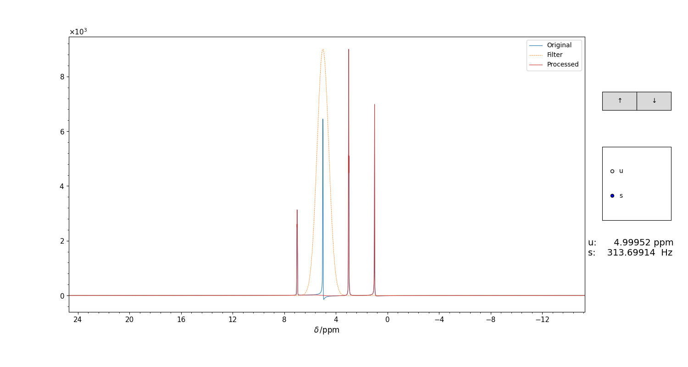
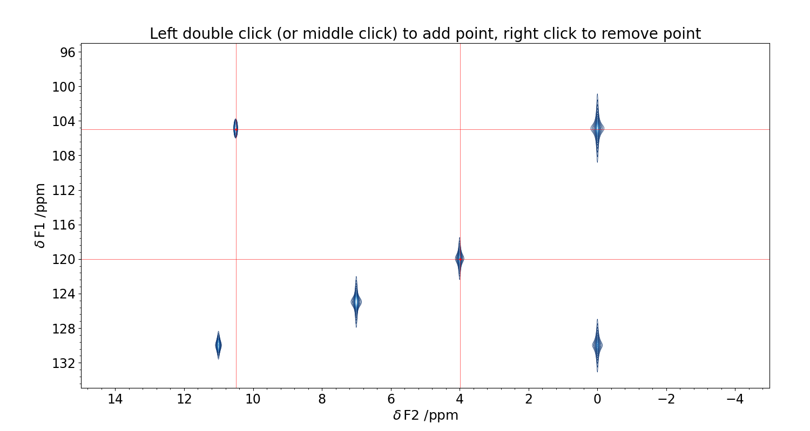
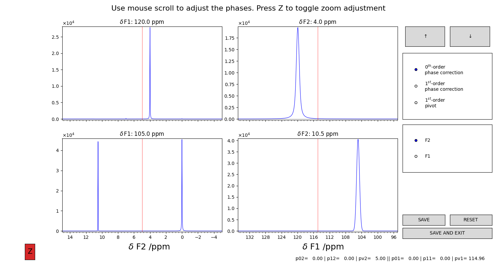
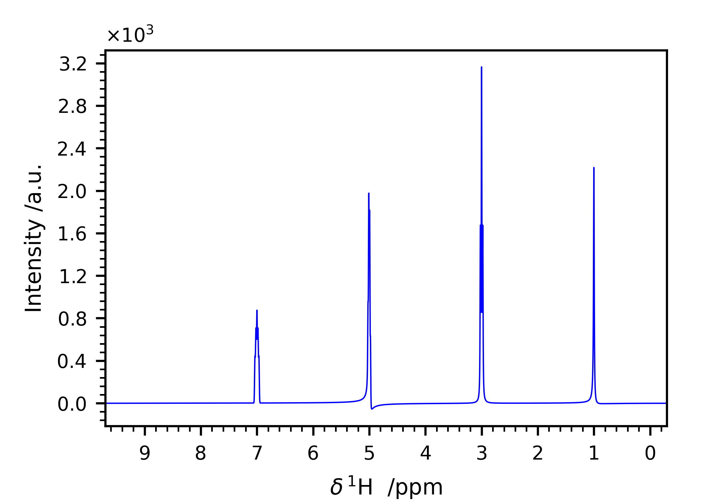
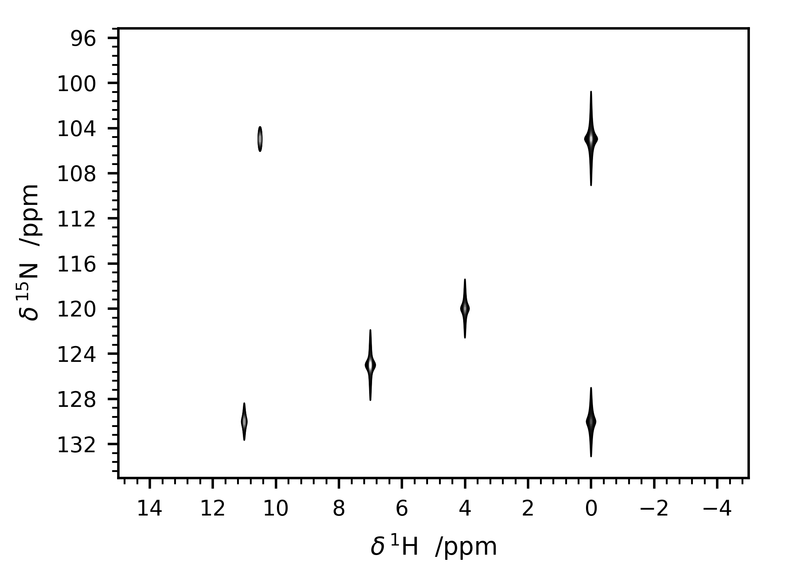
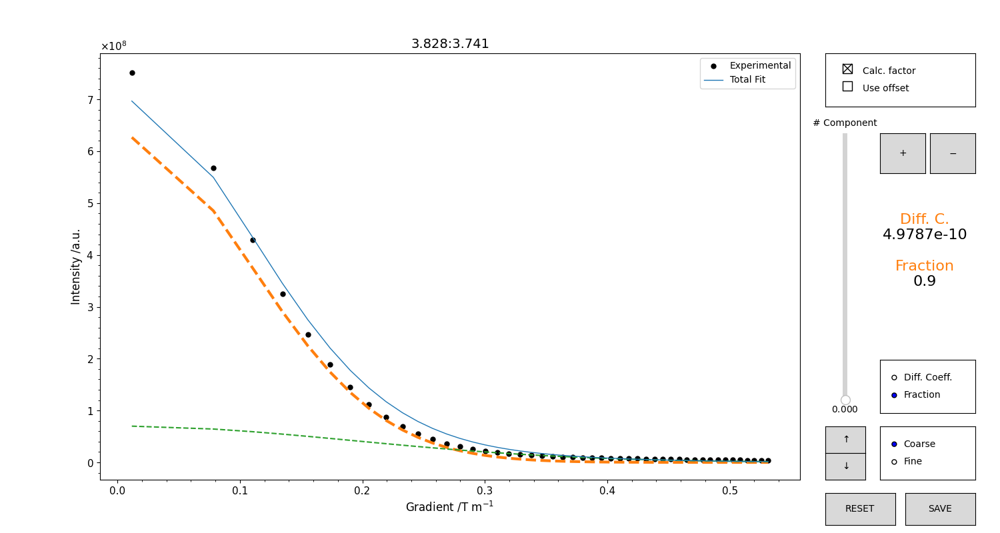
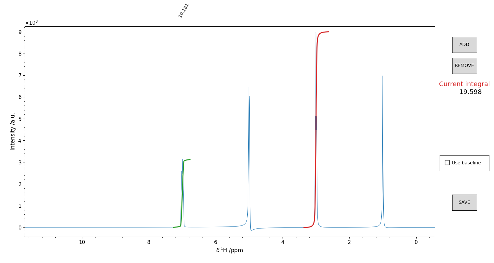
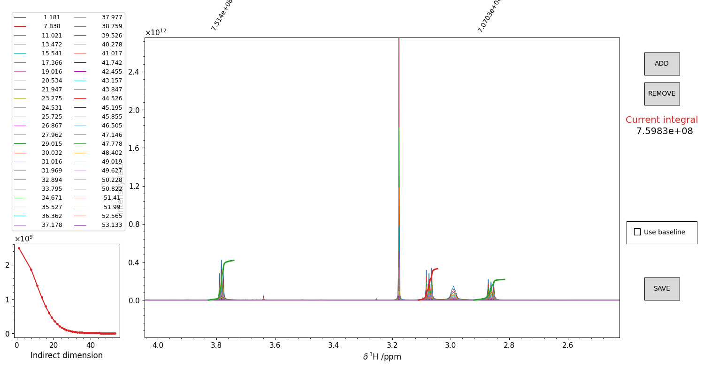

.. _userguide:

User Guide and Examples
=======================

Processing of a "raw" 1D spectrum
*********************************

Let us say that your spectrum is saved in the folder
`/home/myself/spectra/mydataset/1/`. Initialize the spectrum object
through:

::

   Path = r"/home/myself/spectra/mydataset/1/"
   s = Spectrum_1D(Path)

This command will do three main tasks:

-  read the binary FID of your spectrum and store it in a complex array
   ``s.fid``;

-  load the acquisition parameters, read the interesting keys and store
   them in a dictionary ``s.acqus``;

-  initialize a dictionary ``s.procs`` which contains the processing
   parameters.

*KLASSEZ* is able to read also Varian and Spinsolve (Magritek) data,
by specifying the option "``spect``".

A detailed description of ``acqus`` and ``procs`` is shown in
:numref:`t-acqus_1D` and :numref:`t-procs_1D`.

Please note that reading the spectrum causes the program to save a file
called *"name.procs"*, where "name" is the path name.

.. table:: Description of the ``acqus`` dictionary of a ``Spectrum_1D`` object.
    :name: t-acqus_1D

    +-------------+-------------------------------------------------------+
    | Key         | Explanation                                           |
    +=============+=======================================================+
    | ``B0``      | Magnetic field strength /T                            |
    +-------------+-------------------------------------------------------+
    | ``spect``   | Spectrometer format: ``simulated``, ``bruker``,       |
    |             | ``varian``, ``oxford``                                |
    +-------------+-------------------------------------------------------+
    | ``BYTORDA`` | Endianness of binary data: ``0`` little endian, ``1`` |
    |             | big endian                                            |
    +-------------+-------------------------------------------------------+
    | ``DTYPA``   | Binary data type: ``0`` *int32*, ``2`` *float64*      |
    +-------------+-------------------------------------------------------+
    | ``GRPDLY``  | Number of points of the digital filter                |
    +-------------+-------------------------------------------------------+
    | ``nuc``     | Observed nucleus                                      |
    +-------------+-------------------------------------------------------+
    | ``o1p``     | Carrier frequency i.e. center of the spectrum, in ppm |
    +-------------+-------------------------------------------------------+
    | ``o1``      | Same as ``o1p``, but in Hz                            |
    +-------------+-------------------------------------------------------+
    | ``SWp``     | Sweep width, in ppm                                   |
    +-------------+-------------------------------------------------------+
    | ``SW``      | Sweep width, in Hz                                    |
    +-------------+-------------------------------------------------------+
    | ``SFO1``    | Larmor frequency of the observed nucleus at field     |
    |             | ``B0``                                                |
    +-------------+-------------------------------------------------------+
    | ``TD``      | Number of sampled complex points                      |
    +-------------+-------------------------------------------------------+
    | ``dw``      | Dwell time, i.e. the sampling interval, in seconds    |
    +-------------+-------------------------------------------------------+
    | ``AQ``      | Time duration of the FID                              |
    +-------------+-------------------------------------------------------+
    | ``t1``      | Acquisition timescale                                 |
    +-------------+-------------------------------------------------------+

.. table:: Description of the ``procs`` dictionary of a ``Spectrum_1D`` object.
    :name: t-procs_1D

    +------------+--------------------------------------------------------+
    | Key        | Explanation                                            |
    +============+========================================================+
    | ``wf``     | Window function. This is a dictionary itself:          |
    |            |                                                        |
    |            | -  ``"mode"``: choose function between                 |
    |            |                                                        |
    |            |    -  ``"no"``: no apodization                         |
    |            |                                                        |
    |            |    -  ``"em"``: exponential                            |
    |            |                                                        |
    |            |    -  ``"sin"``: sine                                  |
    |            |                                                        |
    |            |    -  ``"qsin"``: squared sine                         |
    |            |                                                        |
    |            |    -  ``"gm"``: mixed lorentzian-gaussian              |
    |            |                                                        |
    |            |    -  ``"gmb"``: mixed lorentzian-gaussian, Bruker     |
    |            |       style                                            |
    |            |                                                        |
    |            | -  ``"lb"``: Exponential line-broadening. Read by      |
    |            |    ``em``                                              |
    |            |                                                        |
    |            | -  ``"lb_gm"``: Exponential line-broadening. Read by   |
    |            |    ``gm``                                              |
    |            |                                                        |
    |            | -  ``"gb"``: Gaussian line-broadening. Read by ``gmb`` |
    |            |                                                        |
    |            | -  ``"gb_gm"``: Gaussian line-broadening. Read by      |
    |            |    ``gm``                                              |
    |            |                                                        |
    |            | -  ``"gc"``: Center of the gaussian :math:`\in [0,1]`. |
    |            |    Read by ``gm``                                      |
    |            |                                                        |
    |            | -  ``"ssb"``: Shift of the sine bell. Read by ``sin``  |
    |            |    and ``qsin``                                        |
    |            |                                                        |
    |            | -  ``"sw"``: Sweep width. Automatically set according  |
    |            |    to ``acqus["SW"]``                                  |
    +------------+--------------------------------------------------------+
    | ``zf``     | Zero-filling. Set the *final* number of points!        |
    +------------+--------------------------------------------------------+
    | ``tdeff``  | Number of points to be used for processing             |
    +------------+--------------------------------------------------------+
    | ``fcor``   | Scaling factor for the first point of the FID before   |
    |            | Fourier transform                                      |
    +------------+--------------------------------------------------------+
    | ``p0``     | Frequency-independent phase correction /degrees        |
    +------------+--------------------------------------------------------+
    | ``p1``     | First order phase correction /degrees                  |
    +------------+--------------------------------------------------------+
    | ``pv``     | Pivot point for the first order phase correction /ppm  |
    +------------+--------------------------------------------------------+
    | ``basl_c`` | Set of coefficients of a polynomion to be used as      |
    |            | baseline, starting from the :math:`0`-order            |
    |            | coefficient                                            |
    +------------+--------------------------------------------------------+
    | ``cal``    | Offset, in ppm, to be added to the frequency and ppm   |
    |            | scales for calibration                                 |
    +------------+--------------------------------------------------------+

To make the Fourier transform of the FID to obtain the spectrum, you
must invoke the :func:`klassez.Spectra.Spectrum_1D.process` method, which reads the ``procs`` dictionary
to get the instructions on the processing you want to make on your
spectrum. For instance, if you want to obtain a final spectrum of
:math:`8k` points with an exponential broadening of 25 Hz:

::

   s.procs["wf"]["mode"] = "em"
   s.procs["wf"]["lb"] = 25
   s.procs["zf"] = 8192
   s.process()
   s.pknl()    # Tries to remove the digital filter through a first-order phase correction

It is also possible to use composite functions by combining more methods.
For instance:

::

   s.procs["wf"]["mode"] = "em", "qsin"
   s.procs["wf"]["lb"] = 10, 0
   s.procs["wf"]["ssb"] = 0, 2

will generate a composite window function made with ``em, lb=10`` and ``qsin, ssb=2``.

Calling the :func:`klassez.Spectra.Spectrum_1D.process` method generates new attributes of the class:

-  ``self.freq``: the frequency scale, in Hz;

-  ``self.ppm``: the ppm scale;

-  ``self.r``: the real part of the spectrum;

-  ``self.i``: the imaginary part of the spectrum;

-  ``self.S``: the complex spectrum
   (:math:`{\tt S} = {\tt r} + \ui {\tt i}`).

After the Fourier transform, the :func:`klassez.Spectra.Spectrum_1D.process` method applies the phase
correction and the calibration using the phase angles and the
calibration value saved in the ``procs`` dictionary automatically. This
allows the user to not phase their spectra every time, as well as
keeping a record of the processing.

If the spectrum requires phase correction, you can perform it
interactively (:numref:`f-adjph_1D`):

::

   s.adjph()

or by passing the phase angles, in degrees, to :meth:`adjph`. Example, if
you know you need to phase your spectrum with :math:`30` degrees of
:math:`\phi^{(0)}` and :math:`-55` degrees of :math:`\phi^{(1)}` with
the pivot set at 7.32 ppm:

::

   s.adjph(p0=30, p1=-55, pv=7.32)

In both cases, the phase angles are updated in the ``procs`` dictionary.

   GUI for the interactive phase correction of a 1D spectrum.
   You can select the value to modify (0, 1st order or pivot) from the selector on the right.
   Then, use the mouse scroll to edit the values.
   The arrow buttons at the top increase or decrease the sensitivity of the movement.
   Press "Z" on the keyboard to toggle the automatic adjustment of the vertical limits.
   Press "SAVE" to save the results of the phasing.

The spectrum can be calibrated by using a dedicated GUI (:numref:`f-cal_1D`).
To do so, you must call for the method :func:`klassez.Spectra.Spectrum_1D.cal` with the option ``from_procs=False``.
The option ``from_procs=True`` (default) will only apply the values stored in ``self.procs['cal']``.

::

   s.cal(from_procs=False)

Alternatively, you can specify the shift value in ppm or in Hz (in this case, be sure to
set the ``isHz`` keyword to ``True``).

::

   s.cal(-3)               # Shift of -3 ppm
   s.cal(1000, isHz=True)  # Shift of +1 kHz   

Both ``ppm`` and ``freq`` are updated according to the given values.

   GUI for the interactive calibration of a 1D spectrum.
   The green bar moves together with the spectrum, the red bar is the reference. 
   First, set the green bar with right-double-click of the mouse on a reference signal.
   Then, set the red bar with left-double-click on the final, calibrated position on the ppm scale.
   Now, use the mouse scroll to move the spectrum, or click on the "OVERLAY" button to teleport the green position on the red.
   The values are written on the right side of the figure panel.
   Press "SAVE" to store the result.

Another sometimes useful feature is the possibility to remove one signal from the spectrum (usually, the solvent resonance).
To do so, there is the :func:`klassez.Spectra.Spectrum_1D.qfil` method.

::

    s.qfil()

The idea is to apply a reverse-gaussian filter (i.e. a V-shaped function that is 1 everywhere and goes to 0 at a given position, smoothly as a Gaussian),
with the position in ppm and the width in Hz.
When invoked, the function will first look into the ``procs`` dictionary to see if there is a ``'qfil'`` key. If it exists, the function computes the filter
and applies it without further questions. Otherwise, it opens a GUI for the visual optimization of the parameters, which is shown in :numref:`f-qfil`.
If the option ``from_procs=False`` is passed, the GUI is opened anyways and the final values are overwritten.

    GUI for the selection of the parameters for the gaussian filter for :func:`klassez.processing.qfil`, which is invoked by the :meth:`qfil` of the Spectra classes.
    The filter appears, upside down, as an orange trace. The original spectrum appears in blue, the spectrum after the filtering is displayed in real time in red.
    Use the mouse scroll to adjust the values (which appear under the selector box). Close the figure to save the parameters.

It is also possibile to pass the values of the filter from outside, without passing for the GUI:

::

    u = 5.0     # chemical shift of the signal to suppress
    s = 310     # standard deviation of the filter in Hz
    s.qfil(u=u, s=s)

The filter is applied directly on the real part of the spectrum only. The imaginary part is automatically reconstructed via Hilbert transform.
Therefore, if you want to perform further processing, be sure to have zero-filled the FID to at least twice its original size, otherwise you will get errors!

The class ``pSpectrum_1D``
--------------------------

The class :class:`Spectrum_1D` does not work if you want to read the
processed data directly from TopSpin (or whatever software you used to
acquire and process them). Instead, you should use the class
:class:`klassez.Spectra.pSpectrum_1D`, which is designed to perform exactly this task. It
inherits most of the attributes and methods of the :class:`klassez.Spectra.Spectrum_1D`
class, therefore its usage closely resembles the example reported in the
previous section.

Processing of a "raw" 2D spectrum
*********************************

Let us say that your spectrum is saved in the folder
`/home/myself/spectra/mydataset/21/`. Initialize the spectrum object
through:

::

   Path = r"/home/myself/spectra/mydataset/21/"
   s = Spectrum_2D(Path)

The generated ``acqus`` and ``procs`` dictionaries include informations
on both dimensions.

.. table:: Description of the ``acqus`` dictionary of a ``Spectrum_2D`` object.
    :name: t-acqus_2D

    +-------------+-------------------------------------------------------+
    | Key         | Explanation                                           |
    +=============+=======================================================+
    | ``B0``      | Magnetic field strength /T                            |
    +-------------+-------------------------------------------------------+
    | ``BYTORDA`` | Endianness of binary data: ``0`` little endian, ``1`` |
    |             | big endian                                            |
    +-------------+-------------------------------------------------------+
    | ``DTYPA``   | Binary data type: ``0`` *int32*, ``2`` *float64*      |
    +-------------+-------------------------------------------------------+
    | ``GRPDLY``  | Number of points of the digital filter                |
    +-------------+-------------------------------------------------------+
    | ``nuc1``    | Observed nucleus in the indirect dimension            |
    +-------------+-------------------------------------------------------+
    | ``nuc2``    | Observed nucleus in the direct dimension              |
    +-------------+-------------------------------------------------------+
    | ``o1p``     | Carrier frequency i.e. center of the indirect         |
    |             | dimension, in ppm                                     |
    +-------------+-------------------------------------------------------+
    | ``o2p``     | Carrier frequency i.e. center of the direct           |
    |             | dimension, in ppm                                     |
    +-------------+-------------------------------------------------------+
    | ``o1``      | Same as ``o1p``, but in Hz                            |
    +-------------+-------------------------------------------------------+
    | ``o2``      | Same as ``o2p``, but in Hz                            |
    +-------------+-------------------------------------------------------+
    | ``SW1p``    | Sweep width of the indirect dimension, in ppm         |
    +-------------+-------------------------------------------------------+
    | ``SW2p``    | Sweep width of the direct dimension, in ppm           |
    +-------------+-------------------------------------------------------+
    | ``SW1``     | Sweep width of the indirect dimension, in Hz          |
    +-------------+-------------------------------------------------------+
    | ``SW2``     | Sweep width of the indirect dimension, in Hz          |
    +-------------+-------------------------------------------------------+
    | ``SFO1``    | Larmor frequency of the observed nucleus in F1 at     |
    |             | field ``B0``                                          |
    +-------------+-------------------------------------------------------+
    | ``SFO2``    | Larmor frequency of the observed nucleus in F2 at     |
    |             | field ``B0``                                          |
    +-------------+-------------------------------------------------------+
    | ``TD1``     | Number of :math:`t_1`-increments                      |
    +-------------+-------------------------------------------------------+
    | ``TD2``     | Number of sampled complex points                      |
    +-------------+-------------------------------------------------------+
    | ``dw1``     | :math:`t_1` increments, in seconds                    |
    +-------------+-------------------------------------------------------+
    | ``dw2``     | Dwell time, i.e. the sampling interval, in seconds    |
    +-------------+-------------------------------------------------------+
    | ``AQ1``     | Sampled timescale of the indirect dimension           |
    +-------------+-------------------------------------------------------+
    | ``AQ2``     | Time duration of the FID                              |
    +-------------+-------------------------------------------------------+
    | ``t1``      | Evolution timescale                                   |
    +-------------+-------------------------------------------------------+
    | ``t2``      | Acquisition timescale                                 |
    +-------------+-------------------------------------------------------+

.. table:: Description of the ``procs`` dictionary of a ``Spectrum_2D`` object. Each of these dictionary entry is a list of two elements: the first one (index ``0``) is the processing to apply on the indirect dimension, the second (index ``1``) on the direct dimension. For instance, ``procs[tdeff] = [64, 1024]`` means to truncate the indirect evolutions to 64 points and the FIDs to 1024 points.
    :name: t-procs_2D

    +-----------+---------------------------------------------------------+
    | Key       | Explanation                                             |
    +===========+=========================================================+
    | ``wf``    | Window function. This is a dictionary itself:           |
    |           |                                                         |
    |           | -  ``"mode"``: choose function between                  |
    |           |                                                         |
    |           |    -  ``"no"``: no apodization                          |
    |           |                                                         |
    |           |    -  ``"em"``: exponential                             |
    |           |                                                         |
    |           |    -  ``"sin"``: sine                                   |
    |           |                                                         |
    |           |    -  ``"qsin"``: squared sine                          |
    |           |                                                         |
    |           |    -  ``"gm"``: mixed lorentzian-gaussian               |
    |           |                                                         |
    |           |    -  ``"gmb"``: mixed lorentzian-gaussian, Bruker      |
    |           |       style                                             |
    |           |                                                         |
    |           | -  ``"lb"``: Exponential line-broadening. Read by       |
    |           |    ``em`` and ``gmb``                                   |
    |           |                                                         |
    |           | -  ``"lb_gm"``: Exponential line-broadening. Read by    |
    |           |    ``gm``                                               |
    |           |                                                         |
    |           | -  ``"gb"``: Gaussian line-broadening. Read by ``gmb``  |
    |           |                                                         |
    |           | -  ``"gb_gm"``: Gaussian line-broadening. Read by       |
    |           |    ``gm``                                               |
    |           |                                                         |
    |           | -  ``"gc"``: Center of the gaussian :math:`\in [0,1]`.  |
    |           |    Read by ``gm``                                       |
    |           |                                                         |
    |           | -  ``"ssb"``: Shift of the sine bell. Read by ``sin``   |
    |           |    and ``qsin``                                         |
    |           |                                                         |
    |           | -  ``"sw"``: Sweep width. Automatically set according   |
    |           |    to ``acqus["SW"]``                                   |
    +-----------+---------------------------------------------------------+
    | ``zf``    | Zero-filling. Set the *final* number of points!         |
    +-----------+---------------------------------------------------------+
    | ``tdeff`` | Number of points to be used for processing              |
    +-----------+---------------------------------------------------------+
    | ``fcor``  | Scaling factor for the first point of the FID before    |
    |           | Fourier transform                                       |
    +-----------+---------------------------------------------------------+
    | ``p02``   | Frequency-independent phase correction /degrees, direct |
    |           | dimension                                               |
    +-----------+---------------------------------------------------------+
    | ``p12``   | First order phase correction /degrees, direct dimension |
    +-----------+---------------------------------------------------------+
    | ``pv2``   | Pivot point for the first order phase correction /ppm,  |
    |           | direct dimension                                        |
    +-----------+---------------------------------------------------------+
    | ``p01``   | Frequency-independent phase correction /degrees,        |
    |           | indirect dimension                                      |
    +-----------+---------------------------------------------------------+
    | ``p11``   | First order phase correction /degrees, indirect         |
    |           | dimension                                               |
    +-----------+---------------------------------------------------------+
    | ``pv1``   | Pivot point for the first order phase correction /ppm,  |
    |           | indirect dimension                                      |
    +-----------+---------------------------------------------------------+
    | ``cal_1`` | Calibration offset for F1 /ppm                          |
    +-----------+---------------------------------------------------------+
    | ``cal_2`` | Calibration offset for F2 /ppm                          |
    +-----------+---------------------------------------------------------+

Then, the sequence of commands for the processing resembles the ones of the 1D spectra.

::

   s.process()     
   s.pknl()    # Remove the digital filter
   # Also in this case, phase correction and calibration are performed automatically with the values in procs
   s.adjph()
   s.plot()

The keys for ``adjph`` are of the kind: ``pXY``, where ``X`` is the
order of the phase correction (:math:`0` or :math:`1`) and ``Y`` is the
dimension on which to apply it (:math:`1` or :math:`2`). Explicative
table below:

.. container:: center

   ================== ======= =======
   \                  **F1**  **F2**
   ================== ======= =======
   :math:`\phi^{(0)}` ``p01`` ``p02``
   :math:`\phi^{(1)}` ``p11`` ``p12``
   pivot              ``pv1`` ``pv2``
   ================== ======= =======

The GUI for the interactive phase correction on 2D spectra works in two steps. First, you have to select
the traces to use as probes for the phase of the spectrum (:numref:`f-traces_selector`). Then, you can proceed to the actual phasing (:numref:`f-adjph_2D`).

    
    GUI for the selection of the traces to be used for the phase correction. Double click with the mouse
    where you want to compute the projection, and a red crossmark will appear. To remove an existing marker, 
    align the cursor with it and click with the right button of the mouse. Use the scroll to adjust the contour
    levels. Close the figure to save.
    

    Here, the projections computed as in :numref:`f-traces_selector` are drawn in this plot.
    The projection on the direct dimension are in the left column, the ones of the indirect dimension are in the right column.
    Use the selector and the mouse scroll to change the values of the parameters. You will see all the traces to change
    in response of your actions.
    Press "SAVE AND CLOSE" to save the processed spectrum.

   
The calibration of a 2D spectrum works as in the 1D case, using the :func:`klassez.Spectra.Spectrum_2D.cal` method.
For the interactive calibration, you will be prompted to select a reference trace
by using the same GUI of :numref:`f-traces_selector`. Then you will calibrate one dimension at the time with the GUI in :numref:`f-cal_1D`.

::
    
    s.cal()

If you are sure that you want to calibrate only one dimension, there exist wrapper methods:

::

    s.calf2()
    s.calf1()

On the processed data, one may want to use the method :meth:`qfil` to suppress the solvent signal.
This can be done interactively by invoking the function without further arguments:

::
        
   s.qfil()

The function works exactly as the 1D counterpart. However, the GUI will first ask you to select a trace to use
as reference for the computation of the filter, which is applied in a ridge-like manner on the whole 2D spectrum.
The imaginary parts are reconstructed via Hilbert transform, hence be sure to have zero-filled enough!
The key ``qfil = {'u': u, 's': s}`` are then saved in the ``procs`` dictionary for additional use.

Another useful option is to make a so-called "strip transform" to use only the part of the spectrum you are interested in.
Example:

::

   xlim = (max(s.ppm), 6)
   ylim = None
   s.strip(xlim=xlim, ylim=ylim)

will trim the direct dimension from the left side of the spectrum to 6 ppm, and leave the indirect dimension untouched.

To read the processed data, use the :class:`pSpectrum_2D` class instead.

Computing projections
---------------------

While the 2D spectra give an overall look on the whole experiment, the
user might want to extract projection of the direct or the indirect
dimension, to focus onto particular features in the spectrum. In order
to do so, *KLASSEZ* offers two commands: ``projf1`` and ``projf2``,
which compute the sum projections on the indirect or on the direct
dimension, respectively, and store the result in dictionaries called
``trf1`` and ``trf2``, whose keys are the ppm values correspondant to
the projections. Actually, the capitalized versions of the two
dictionaries (with the same keys), i.e. ``Trf1`` and ``Trf2``, can be
more useful, as they are instances of the :class:`pSpectrum_1D` class and
therefore are initialized with ppm scales and other parameters.

Example:

::

   # Supposed to have a 1H-15N HSQC spectrum

   #   Extract the direct dimension trace at 115 ppm, 15N scale
   s.projf2(115)   
   #   Access to it through
   Proj_115 = s.Trf2['115.00']

   #   Extract the indirect dimension trace from 6 to 8 ppm, 1H scale
   s.projf1(6, 8)
   Proj_indim = s.Trf1['6.00:8.00']

   # You can plot them:
   Proj_115.plot()
   Proj_indim.plot()

Simulating data
***************

The classes :class:`Spectrum_1D` and :class:`Spectrum_2D` are also able to
generate simulated data by reading a custom-written input file. The
functions they use are :func:`klassez.sim.sim_1D` and :func:`klassez.sim.sim_2D`.

Simulate 1D data
----------------

The input file you have to write *must* have the following keys:

-  ``B0``: Magnetic field strength /T;

-  ``nuc``: Observed nucleus (e.g. ``13C``);

-  ``o1p``: Carrier frequency i.e. centre of the spectrum /ppm;

-  ``SWp``: Sweep width /ppm. The spectrum will cover the range
   :math:`[{\tt o1p} - {\tt SWp}/2, {\tt o1p} + {\tt SWp}/2]`;

-  ``TD``: Number of sampled (complex) points;

-  ``shifts``: sequence of peak positions /ppm;

-  ``fwhm``: Full-width at half-maximum of the peaks /Hz;

-  ``amplitudes``: Intensity of the peaks in the FID;

-  ``b``: Fraction of gaussianity. :math:`\beta = 0 \implies` pure
   Lorentzian peak, :math:`\beta = 1 \implies` pure Gaussian peak;

and *can* have the following keys:

-  ``phases``: phases of the peaks /degrees. Default: all zeros;

-  ``mult``: fine structures of the peaks (e.g. doublets of triplets:
   ``dt``). Default: all singlets;

-  ``Jconst``: coupling constants of the fine structures /Hz. If more of
   one coupling is expected, provide them as a sequence. Default: not
   used as the peaks are all singlets.

Key and value must be separated by a tab character. You are allowed to
leave empty rows to improve the readibility and to insert comments using
the ``#`` character.

Example:

.. code-block::
    :caption: Input file for the simulation of 1D spectrum.
    :name: lst-acqus_1D
    
    B0          16.4    # 700 MHz 1H
    nuc         1H
    o1p         4.7
    SWp         40
    TD          8192

    shifts      1, 3, 5, 7
    fwhm        [10 for k in range(4)]
    amplitudes  10, 20, 15, 10
    b           0, 0.4, 0.6, 1
    phases      5, 0, 10, 0

    mult        s, t, dt, ddd   
    Jconst      0, 15, [12, 9.5], [25, 15, 10]

This input file generates the spectrum in :numref:`f-test_1D`.

Code:

::

   #! /usr/bin/env python3

   from klassez import *

   s = Spectrum_1D('sim_in_1D', isexp=False)
   s.process()

   figures.figure1D(s.ppm, s.r, name='test_1D', X_label=r'$\delta\, ^1$H  /ppm', Y_label=r'Intensity /a.u.')

   
    Simulated spectrum with the input file shown in :numref:`lst-acqus_1D`.

Simulate 2D data
----------------

The same procedure can be followed to simulate 2D spectra. The input
file to write is very similar to the one for 1D data, except for the
quantities that clearly span over two dimensions. As in NMR textbook,
the direct and indirect dimensions will be named F2 and F2 respectively,
and dimension-specific quantities will feature the 1 or 2 labels
accordingly.

-  ``B0``: Magnetic field strength /T;

-  ``nuc1``: Observed nucleus in F1(e.g. ``13C``);

-  ``nuc2``: Observed nucleus in F2(e.g. ``1H``);

-  ``o1p``: Carrier frequency i.e. center of F1 /ppm;

-  ``o2p``: Carrier frequency i.e. center of F2 /ppm;

-  ``SW1p``: Sweep width /ppm. The indirect dimension will cover the
   range :math:`[{\tt o1p} - {\tt SW1p}/2, {\tt o1p} + {\tt SW1p}/2]`;

-  ``SW2p``: Sweep width /ppm. The direct dimension will cover the range
   :math:`[{\tt o2p} - {\tt SW2p}/2, {\tt o2p} + {\tt SW2p}/2]`;

-  ``TD1``: Number of sampled (complex) points in F1;

-  ``TD2``: Number of sampled (complex) points in F2;

-  ``shifts_f1``: sequence of peak positions in F1 /ppm;

-  ``shifts_f2``: sequence of peak positions in F2 /ppm;

-  ``fwhm_f1``: Full-width at half-maximum of the peaks in F1 /Hz;

-  ``fwhm_f2``: Full-width at half-maximum of the peaks in F2 /Hz;

-  ``amplitudes``: Intensity of the peaks in the FID;

-  ``b``: Fraction of gaussianity. :math:`\beta = 0 \implies` pure
   Lorentzian peak, :math:`\beta = 1 \implies` pure Gaussian peak;

Phase distortions and fine structures are not allowed for
multidimensional spectra. The indirect dimension will be generated
employing the *States-TPPI* sampling scheme.

Example:

.. code-block::
   :caption: Input file for the simulation of a 2D spectrum
   :name: lst-acqus_2D

   B0           28.2
   nuc1         15N 
   nuc2         1H
   o1p          115 
   o2p          5   
   SW1p         40  
   SW2p         20
   TD1          256 
   TD2          2048

   shifts_f1    130.0, 105.0, 120.0, 1.25e2, 130.0, 105.0
   shifts_f2    0.0, 0.0, 4.0, 7.0, 1.1e1, 10.5
   fwhm_f1      100, 100, 100, 100, 100, 100
   fwhm_f2      50, 50, 50, 50, 50, 50
   amplitudes   10, 20, 10, 20, 10, 10
   b            0.0, 0.2, 0.4, 0.6, 0.8, 1.0

This input file generates the spectrum in :numref:`f-test_2D`.

Code:

::

   #! /usr/bin/env python3

   from klassez import *

   s = Spectrum_2D('sim_in_2D', isexp=False)
   s.process()

   figures.figure2D(s.ppm_f2, s.ppm_f1, s.rr, lvl=0.005, name='test_2D', X_label=r'$\delta\, ^1$H  /ppm', Y_label=r'$\delta\, ^{15}$N  /ppm')

    
    Simulated 2D spectrum with the input file shown in :numref:`lst-acqus_2D`.

    

The ``Pseudo_2D`` class
***********************

"Classic" pseudo-2D processing
------------------------------

Sometimes, the spectroscopist might find interesting to acquire a series
of 1D experiments in which one (or more) parameters are changed
according to a certain schedule. This kind of experiments are 2D in
principle, but their processing and analysis resemble the one of 1D
spectra. Therefore, they lie somewhere in between 1D spectra and 2D
spectra, hence they are often referred to as *pseudo_2D*.

Also in this case, *KLASSEZ* offers a specific class to deal with this
kind of data: :class:`klassez.Spectra.Pseudo_2D`. :class:`Pseudo_2D` is a subclass of
:class:`Spectrum_2D`; however, many functions have been adapted to resemble
the 1D version.

:class:`Pseudo_2D` does not encode for a routine to automatically simulate
data. If you want to, you should give a 1D-like input file (just like
the one in the previous section), and replace the attribute
``fid`` with your FID by using the method :meth:`mount`, generated as you
wish. With a real dataset this is not required, as it is able to read
everything automatically.

::

   path_to_pseudo = "/home/myself/spectra/mydataset/899/"
   s = Pseudo_2D(path_to_pseudo)

The :meth:`process()` function applies apodization, zero-filling and Fourier
transform only on the direct dimension, reading the parameters from a
``procs`` dictionary like the one of :class:`Spectrum_1D`. The attributes
``freq_f1`` and ``ppm_f1`` are initialized with
``np.arange(N)``, where ``N`` is the number of
experiments that your FID comprises of. In particular, ``freq_f1``
numbers the experiments sequentially from :math:`0` to :math:`N-1`,
whereas ``ppm_f1`` does it from :math:`1` to :math:`N`. Therefore, when
calling the method ``projf2`` to extract the experiments as
``Spectrum_1D`` objects, the argument must follow ``ppm_f1``. As an
example, to project the first transient, one should type

::

   s.projf2(1)

and access to it from

::

   t = s.Trf2["1.00"]

The user can replace this "standard" numbering with the actual parameter
that is varied during the evolution of the indirect dimension, by
substitution of the ``ppm_f1`` attribute. As a result, the projection
must be performed according to this new scale.

The phase adjustment is performed on a reference spectrum, then applied
on the whole 2D matrix. By default, the chosen spectrum is the first
one, but you can choose the one that fits the most your needs.

::

   s.process()
   s.pknl()        # Tries to remove the digital filter
   s.adjph(expno=10) # Calls interactive_phase_1D on the 10th experiment

The method :meth:`plot` shows the 2D contour map of the spectrum, just like
the one of :meth:`Spectrum_2D`. However, this is not always the most
intelligent way to plot the data in order to gather information. This is
the reason why this class features two unique additional methods that
plot data: :meth:`plot_md` and :meth:`plot_stacked`. Both rely on the parameter
``which``, that is a string of code (i.e. it should be interpreted by
``eval``) that identifies which experiment to show by pointing at their
index. ``which = "all"`` results in pointing at all spectra.

::

   s.plot()    # 2D contour map
   s.plot_md(which="3, 5, 11")     # Plot the 3rd, the 5th and the 11th spectrum, superimposed
   s.plot_stacked(which="np.arange(0,100,5)")  # Makes a stacked plot with a spectrum every 5

DOSY spectra
------------

One particular kind of pseudo-2D datasets are the Diffusion Ordered Spectroscopy (DOSY).
In these experiment, the strength of a gradient is evolved in the indirect dimension.
The resulting transient will become dependent on the translational diffusion coefficient, 
which can be extracted by fitting this kind of data.

As it is in principle a pseudo-2D, the :class:`klassez.Spectra.DOSY` is a subclass of :class:`klassez.Spectra.Pseudo_2D`,
with added features. 
In this release of klassez, the only supported format for DOSY datasets is the Bruker format.
Upon initialization of a ``DOSY`` instance, klassez will read the FID and the `difflist` from the dataset folder, which
is a text file that contains the strength of the gradients employed during the evolution of the indirect dimension in Gauss / cm.
This list will be saved in the ``self.ppm_f1`` attribute and never overwritten.

The rest of the processing is exactly the same of the classic ``Pseudo_2D``, described in the previous section.
The analysis instead is different because it includes specific routines to fit the DOSY. 
When calling the ``self.integrate`` method, an attribute ``self.D`` will be automatically created as an instance of the class
:class:`klassez.fit.DosyFit`, with the values of the important parameters read by the dataset itself.
In the present release, :class:`klassez.fit.DosyFit` supports the fit for single and double stimulated echoes, with or without bipolar gradients
(sequences `ste`, `stebp`, `dste`, `dstebp`).

The important attributes of the :class:`klassez.fit.DosyFit` class are:

- ``self.g``: 1darray that contains the `difflist` converted to Tesla / meter (so that the diffusion coefficient comes in :math:`m^2 s^{-1}`;

- ``self.data``: dictionary that contains the integrated values of the parent spectrum using the integration region as a key formatted as ``{ppm1:.3f}:{ppm2:.3f}``;
 
- ``self.dosy_par``: dictionary of the parameters that will be employed by the model during the fit.

::

    # Fit of the DOSY
    #   Make/read initial guess
    s.D.iguess(filename=filename)
    #   Fit the data
    s.D.dofit(filename=filename)
    #   Plot the fits
    s.D.plot(filename=filename, dpi=200)
    #   Make a figure of the diffusion coefficients
    s.diffplot(filename=filename, dpi=200)

The method :func:`klassez.fit.DosyFit.iguess` allows to generate an oculated initial guess for all the integrated regions.
More than one component can be used at once for a single region. The user can adjust the relative fraction of the various components,
as well as to adjust the intensity factor automatically or not. Example and additional explanation in :numref:`f-dosy_iguess`.
Computing the initial guess creates a file `<filename>.idy`, that can be read with :func:`klassez.fit.read_dy`.
If the file already exists, it will be loaded and stored in the attribute ``self.i_guess``.

    GUI for the initialization of the diffusion coefficient. The integrals trend will appear as black points.
    The total model is the blue trace. Use the mouse scroll to change either the value of the diffusion coefficient or the fraction, according
    to the selector on the right part of the figure.
    It is possible to change the sensitivity of the scroll with the selector "coarse/fine", or with the arrow buttons. 
    Use the "+" button to add a component. Use the vertical slider to change component to edit.
    The check button at the top toggles the computation of the intensity factor. Deactivate it to gain more freedom in adjusting the 
    relative fraction when trying to adjust multiple components. **DO NOT INCLUDE** the offset unless you have a very specific reason to do so.
    When you are satisfied with your guess, press "SAVE" to save it.
        

At this point, the fit can be performed by calling the method :func:`klassez.fit.DosyFit.dofit`. 
A number of parameters for the fit can be adjusted. The model function is selected automatically on the basis
of the employed pulse sequence (see :func:`klassez.fit.DosyFit.select_model`).
The results of the fit will be saved in a file named `<filename>.fdy`. A new entry of the file will be added at the bottom.
This file **will never be overwritten** automatically by the program.

Alternatively, the results of a previously performed fit can be read from a `.fdy` file by the method :func:`klassez.fit.DosyFit.load_fit`.
In both cases, the outcome will be stored in the attribute ``self.result``.

Now it is the time to see how the fit looks like.
The :func:`klassez.fit.DosyFit.plot` method generates the figure of the fitted trends, that also display the diffusion coefficient value in the legend.
A number of parameters for the figure can be tuned, such as dimension, resolution and format of the figure to save, to display the residuals or not, etc.
When the fit is either performed or loaded (i.e. the attribute ``self.D.result`` exists), the parent ``DOSY`` object gains access to the :func:`klassez.Spectra.DOSY.diffplot`.
This function will generate a figure that display an upper panel with the whole spectrum, and a bottom panel with the fitted diffusion coefficients. 
The integrated regions will be highlighted as light-blue spans in both panels. This will be useful to compare the different diffusion coefficients associated to the various regions, and therefore to the chemical species present in the sample.

Analyzing data in *KLASSEZ*
***************************

Integrate 1D spectra
--------------------

A 1D spectrum represented by the class :class:`klassez.Spectra.Spectrum_1D` can be interactively integrated with a dedicated GUI, that calls for :func:`klassez.anal.integrate`, by typing:

::

   s.integrate()

An example of such interface is shown in :numref:`f-integrals_1D`.
The integrals are computed according to the fundamental theorem of calculus (see :func:`klassez.processing.integrate`), using the frequency (Hz) scale as independent variable.
The obtained values are normalized to the FID intensity. In NMR, the intensity (i.e. the integral) of the whole spectrum
is given by the first point of the FID. To preserve this information (which is something that klassez indeed does), it is required to 
apply a conversion factor to the "raw" integrals equal to twice the dwell time (``2 * self.acqus['dw']``).

The ``self.integrals`` attribute is a dictionary that has the strings ``{ppm1:.3f}:{ppm2:.3f}`` as keys, with ``ppm1`` and ``ppm2`` being the 
ppm values that delimit the integration regions. Each key is associated with the integral of that region.

It is also possible to integrate the spectrum "blindly", i.e. without using the GUI, by specifying the integration regions.
The limits must be passed to the function as a list of 2-entry-tuples, the latter containing the integration regions:
::

    lims = [[3, 2], [9, 8]]
    s.integrate(lims=lims)

If you have a given spectrum ``t`` that you already integrated, and you want to integrate the spectrum ``s`` on the same regions, you can easily convert
the keys of ``t.integrals`` to the limits by using the function :func:`klassez.misc.key_to_limits`:
::

    limits = misc.key_to_limits(list(t.integrals.keys()))
    s.integrate(lims=limits)

After each call of the :func:`integrate` function, a section of a `<filename>.igrl` file is written. 
Such file can be loaded by calling the :func:`klassez.Spectra.Spectrum_1D.read_integrals` method with the name of the file to read:
::

    s.read_integrals(filename='myfilename.igrl')

    GUI for the integration of 1D spectra. Drag and drop the mouse to highlight an integration region.
    The integral will appear as a red trace on top of the spectrum. The height is not indicative of the value (which is written on the right),
    but it is not important, as it is the shape of that curve that matters. It is possible to include a "baseline" for the calculation, that is 
    basically the straight line that connects the borders of the integration window. Might be useful sometimes.
    Once you are satisfied with the integral, press the ADD button. The integral function plot from red becomes green, and you can integrate another
    region. Repeat this procedure for as many peaks as you want. 
    To remove an integral from the list, click on the correspondant integral value displayed in black above the top border of the figure. The integral should become blue.
    Press "REMOVE" to remove it.
    Once you integrated all the regions you were interested in, press "SAVE" to close the figure and write the `.igrl` file.

Deconvolution of 1D datasets
----------------------------

The class :class:`klassez.fit.Voigt_Fit` in *KLASSEZ* offers a very convenient
interface to deconvolve a spectrum by fitting. A shortcut to the class,
which initializes the parameters automatically, is implemented in the
attribute ``F`` of :class:`Spectrum_1D`.

To generate the input guess for the fit, you have to call the method
:meth:`iguess` of the class. This can work in two different modes: the
default one, which allows to build the guess peak-by-peak, and with
``auto=True``, that features a peak-picker for the selection. The former
is more precise, the second is much faster.

Whatever the employed method, the building of the initial guess is a
two-stage process. First, you must zoom in with the :mod:`matplotlib`
interactive viewer on the region of the spectrum you are interested in.
Then, you can build the guess following the instructions in the GUI.
When you press "SAVE", your guess is stored, and the spectrum returns to
the original view.

The "manual" mode allows to optimize a polynomial baseline for each
interval. A button labelled "SET BASL" must be pressed when a satisfying
region is highlighted in the GUI: this allows the scale on which the
baseline is computed to be correctly aligned to the region itself. When
this step is correctly performed, the box next to the button turns from
red to green. Should the region be moved during the optimization of the
initial guess, the box turns back to red, and the "SET BASL" button must
be pressed again to adjust the baseline scale accordingly.

The information on the peaks is saved in a `.vf` file, which can be
imported with the function :func:`klassez.fit.read_vf``. There are two kind of
`.vf` file: `.ivf`, that marks initial guesses, and `.fvf`, for
the results of the fit. However, this is a human-only distinction, as
the structure of the files is the same.

An example of `.vf` file is shown here:

::

   ! Initial guess computed by francesco on 11/11/2024 at 15:48:44

             Region;      Intensity
   ------------------------------------------------------------------------------------------------
    193.317:168.041;   8.08246575e+00

      #;              u;           fwhm;    Rel. I.;      Phase;       Beta;      Group
   ------------------------------------------------------------------------------------------------
      1;   179.94060191;     172.500000;   1.000000;    -10.000;    0.00000;          0
   ------------------------------------------------------------------------------------------------

   ================================================================================================

             Region;      Intensity
   ------------------------------------------------------------------------------------------------
       59.936:6.662;   5.02908980e+01

      #;              u;           fwhm;    Rel. I.;      Phase;       Beta;      Group
   ------------------------------------------------------------------------------------------------
      2;    40.29851786;     150.000000;   0.214286;      0.000;    0.00000;          0
      3;    24.98695246;     140.000000;   0.785714;     10.000;    0.00000;          0
   ------------------------------------------------------------------------------------------------

   ================================================================================================

The header line, that starts with a `!`, is a comment, and acts as a
separator between different attempts of the fit. In fact, `.vf` files
are never overwritten: working again on the same file appends the
information at the bottom. Hence, there is a parameter ``n`` in the
:func:`klassez.fit.read_vf` function that allows to select which attempt to read.

Then, a series of blocks follow. Each block marks a region of selection:
the keys "Region" and "Intensity" mark the limits of the fitting window,
and the total intensity of the peaks. Under this line, there is a table
that collects the peak parameters. As a final information there might be
the baseline coefficients for the given region, which start with the key
"BASL_C". Should this line be missing, it means that the baseline was
not optimized during the computation of the guess, and the coefficients
will all be set to 0 when the file is read. The end of the block is
marked with a line of "=".

The method :meth:`iguess` automatically search for the existing input file.
If it finds it, it is automatically loaded. Otherwise, the GUI for the
computation of the initial guess opens up.

The fit can be performed by calling the method :meth:`dofit`, which returns
a list of ``lmfit.MinimizerResult`` objects (one for each region) for a
detailed inspection on how the fit performed. The behavior of the fit
can be customized by setting the parameters of the method (see examples
or the dedicated page of the manual). The fit goes region-by-region, and
the results are saved in a `.fvf` file.

A `.fvf` file can be loaded using the method :meth:`load_fit`.

Either the initial guess or the result of the fit can be conveniently
visualized by using the method :meth:`plot`. Alternatively, the arrays of
the model can be retrieved by calling :meth:`calc_fit_lines`. The method
:meth:`res_histogram` computes the histogram of the residuals, for a better
understanding of the outcome of the fit procedure.

Vide infra for a working example.

Integrate a pseudo-2D spectrum
------------------------------

The method :func:`klassez.Spectra.Pseudo_2D.integrate` differs a little bit from the one coded in
``Spectrum_1D``, but essentially from the user's perspective it works the same.

::

   s.integrate(ref=0)

The GUI (:numref:`f-integrate_p2D`) will display all the transient stacked one to each other. The integral function
that will appear when dragging the region refers to the reference spectrum, whose index is passed through the ``ref`` argument, but in the
side panel on the bottom left it will appear how the trend of the integrals throughout
the whole series will look like. 
When pressing SAVE, the integrals will be saved in a `.igrl` file, as in the 1D case,
to be recovered with the method :func:`klassez.Spectra.Pseudo_2D.read_integrals`.

::

    s.read_integrals(filename='myfilename.igrl')

The ``self.integrals`` attribute is a dictionary that has the strings ``{ppm1:.3f}:{ppm2:.3f}`` as keys, with ``ppm1`` and ``ppm2`` being the 
ppm values that delimit the integration regions. Each key is associated with the integrals of that region throughout the series, as 1darray.

As in the 1D case, it is possible to integrate the spectrum "blindly", i.e. without using the GUI, by specifying the integration regions.
The limits must be passed to the function as a list of 2-entry-tuples, the latter containing the integration regions:
::

    lims = [[3, 2], [9, 8]]
    s.integrate(lims=lims)

If you have a given spectrum ``t`` that you already integrated, and you want to integrate the spectrum ``s`` on the same regions, you can easily convert
the keys of ``t.integrals`` to the limits by using the function :func:`klassez.misc.key_to_limits`:
::

    limits = misc.key_to_limits(list(t.integrals.keys()))
    s.integrate(lims=limits)

    GUI for the integration of pseudo-2D spectra. Drag and drop the mouse to highlight an integration region.
    The integral of the reference spectrum will appear as a red trace on top of the spectrum. The height is not indicative of the value (which is written on the right),
    but it is not important, as it is the shape of that curve that matters. It is possible to include a "baseline" for the calculation, that is 
    basically the straight line that connects the borders of the integration window. Might be useful sometimes.
    The trend of the computed integrals throughout the series appears in the side panel.
    Once you are satisfied with the integral, press the ADD button. The integral function plot from red becomes green, and you can integrate another
    region. Repeat this procedure for as many peaks as you want. 
    To remove an integral from the list, click on the correspondant integral value displayed in black above the top border of the figure. The integral should become blue.
    Press "REMOVE" to remove it.
    Once you integrated all the regions you were interested in, press "SAVE" to close the figure and write the `.igrl` file.

Example scripts
***************

Reading and processing of 1D spectra
------------------------------------

.. code-block::
   :name: lst-process_1D
   :caption: Example script for processing a 1D spectrum.

   #! /usr/bin/env python3

   from klassez import *

   # Be aware that this is a BASIC processing
   # Read the documentation of the functions to see the full powers

   if 1:
       # This example is for the simulated data
       s = Spectrum_1D('acqus_1D', isexp=False)
       # You can convert info on peaks to .ivf for fitting
       s.to_vf()
   else:
       # Use the following to read experimentals:
       spect = 'bruker', 'jeol', 'varian', 'magritek', 'oxford' # One of these
       s = Spectrum_1D(path_to_dataset, spect=spect)
   # Setup the processing
   #   Apodization
   #   Follow the table in the user manual to see what reads what
   s.procs['wf']['mode'] = 'em'
   s.procs['wf']['lb'] = 5
   #   Zero-filling
   s.procs['zf'] = 2**14
   #   Apply processing and do FT
   s.process()
   #   Remove the digital filter
   s.pknl()

   #   Phase correction
   s.adjph()

   #   Calibration
   s.cal(from_procs=False)

   #   Remove solvent
   s.qfil(from_procs=False)

   # Plot the data
   s.plot()

   # Integrate the spectrum
   s.integrate()

Fit 1D spectrum
---------------

The beginning of the script is the same of the reading example.

.. code-block::
   :name: lst-fit_1D
   :caption: Example script to fit a 1D spectrum. This listing continues from :numref:`lst-process_1D`.

   # s.F is a fit.Voigt_Fit object
   filename = 'test_1D_fit'    # base filename for everything fit-related
   # Compute the initial guess
   auto = False        # True for peak-picker, False for manual
   s.F.iguess(filename=filename, auto=auto)

   if 0:   # Do the fit
       lmfit_result = s.F.dofit(   ### Parameters of the fitting ###
               u_lim=5,            # movement for chemical shift /ppm
               f_lim=50,           # movement for linewidth /Hz
               k_lim=(0, 3),       # limits for intensity
               vary_phase=True,    # optimize the phase of the peak
               vary_b=True,        # optimize the lineshape (L/G ratio)
               method='leastsq',   # optimization method
               itermax=10000,      # max. number of iterations
               fit_tol=1e-10,      # arrest criterion threshold (see lmfit for details)
           basl_fit='fixed'    # how to handle the baseline during the fit
               filename=filename,  # filename for the .fvf file
               )
   else:
       # Load an existing .fvf file
       s.F.load_fit(filename=filename)

   # Plot the results
   s.F.plot(what='result',     # what='iguess' for initial guess
            show_total=True,   # Show the total trace or not
            show_res=True,     # Show the residuals
            res_offset=0.1,    # Displacement of the residuals (plots residuals - res_offset)
            labels=None,       # Labels for the peaks
            filename=filename, # Filename for the figures
            ext='png',         # format of the figure
            dpi=300,           # Resolution of the figure
            )

   # Compute histogram of the residuals
   s.F.res_histogram(what='result',
                 nbins=500,    # Number of bins of the histogram
                 density=True, # Normalize them
                 f_lims=None,  # Limits for x axis
                 xlabel='Residuals',   # Guess what!
                 x_symm=True,  # Symmetrize the x-scale
                 barcolor='tab:green',     # Color of the bars
                 fontsize=20,  # Guess what!
                 filename=filename, ext='png', dpi=300)

   # Convert the tables of numbers in arrays
   peaks, total, limits, whole_basl = s.F.get_fit_lines(what='result')

Read and process 2D spectrum
----------------------------

.. code-block:: 
   :name: lst-process_2D
   :caption: Example script for processing a 2D spectrum.

    #! /usr/bin/env python3

    from klassez import *

    # Be aware that this is a BASIC processing
    # Read the documentation of the functions to see the full powers
    if 1:
        # This example is for the simulated data
        s = Spectrum_2D('acqus_2D', isexp=False)
    else:
        # For experimentals, at version 0.4a.7 klassez reads only 2D bruker
        s = Spectrum_2D(path_to_dataset)

    # Setup the processing
    #   Apodization
    #   Follow the table in the user manual to see what reads what
    #   REMEMBER: index 0 is F1, index 1 is F2, for procs
    s.procs['wf'][1]['mode'] = 'em'
    s.procs['wf'][1]['lb'] = 5
    s.procs['wf'][0]['mode'] = 'qsin'
    s.procs['wf'][0]['ssb'] = 2
    #   Zero-filling
    s.procs['zf'] = 512, 4096
    #   Apply processing and do FT
    s.process()
    #   Remove the digital filter
    s.pknl()

    #   Phase correction
    s.adjph()

    #   Calibrate
    s.cal()

    #   Remove solvent
    s.qfil()

    # Plot the data
    s.plot()

    # Extract projections
    ppm_f1 = 105
    ppm_f2 = 10
    s.projf1(ppm_f2)
    # Extract F1 trace @ ppm_f2 ppm
    f1 = s.Trf1[f'{ppm_f2:.2f}']
    # Call it back: it is a Spectrum_1D object!
    f1.plot()
    s.projf2(ppm_f1)
    # Extract F2 trace @ ppm_f1 ppm
    f2 = s.Trf2[f'{ppm_f1:.2f}']
    # Call it back: it is a Spectrum_1D object!
    f2.plot()

Read, process and fit DOSY
--------------------------

.. code-block::
   :name: lst-process_dosy
   :caption: Example for the processing of a DOSY spectrum. The processing of a ``Pseudo_2D`` is the same!

    #! /usr/bin/env python3

    from klassez import *

    # Read the spectrum
    s = DOSY('apo/11')

    # Processing
    #   Window function: exponential with 0.5 Hz linebroadening
    s.procs['wf']['mode'] = 'em'
    s.procs['wf']['lb'] = 0.5
    #   Zerofill to twice the size
    s.procs['zf'] = 2 * s.fid.shape[-1]
    #   Apply and do FT
    s.process()
    #   Remove digital filter
    s.pknl()
    #   Phase the spectrum (uncomment to do it!)
    s.adjph()
    #   Plot the spectrum to see it
    s.plot_md()

    # Analysis
    filename = 'test'
    #   Integrals
    if 1:       # compute the integrals
        s.integrate(filename=filename)
    else:       # read an integrals file
        s.read_integrals(filename=f'{filename}.igrl')

    # Fit of the DOSY
    #   Make/read initial guess
    s.D.iguess(filename=filename)
    #   Fit the data
    s.D.dofit(filename=filename)
    #   Plot the fits
    s.D.plot(filename=filename, dpi=200)
    #   Make a figure of the diffusion coefficients
    s.diffplot(filename=filename, dpi=200)

